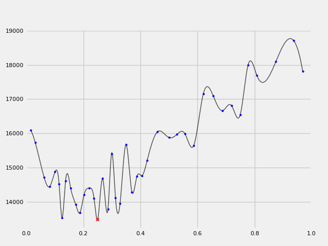
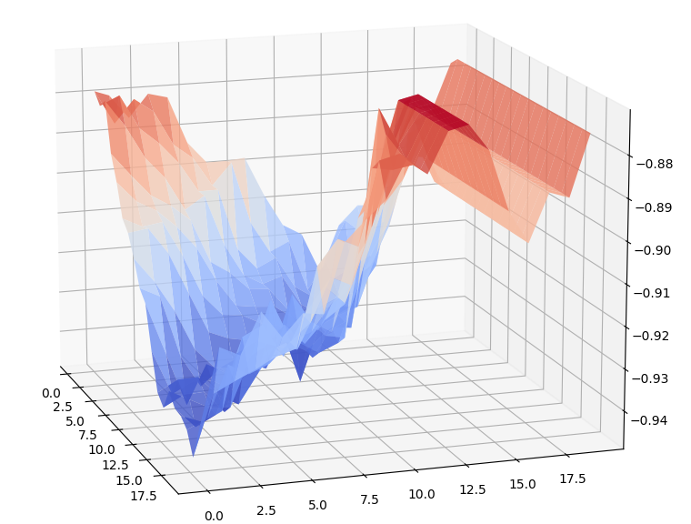
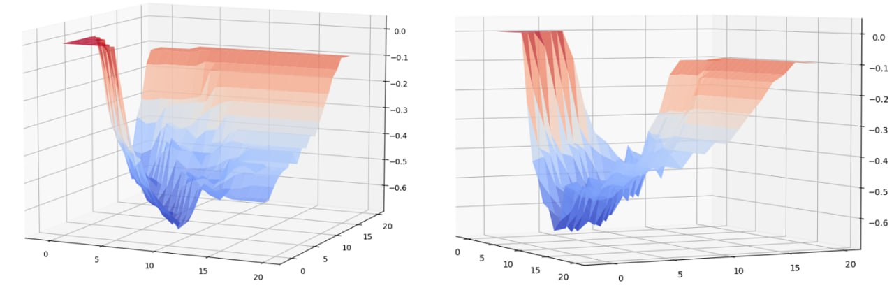

Примеры использования
=====================

Настройка параметров генетического алгоритма для решения задачи коммивояжёра
____________________________________________________________________________

Задача коммивояжёра (или TSP - travelling salesman problem)
является NP-сложной задачей комбинаторной оптимизации,
важной в теоретической информатике и исследовании операций.
Содержательную постановку задачи можно сформулировать
следующим образом: «Для заданного списка городов и расстояний
между каждой парой городов, найти кратчайший возможный маршрут,
который проходит через каждый город ровно один раз и возвращается
в родной город».

Содержательная постановка задачи
~~~~~~~~~~~~~~~~~~~~~~~~~~~~~~~~

Пусть номера :math:`1,2,{\dots},n` соответствуют городам, величины :math:`c_{\mathit{ij}}>0` –
расстояниям между городами :math:`i` и :math:`j`, а величина :math:`x_{\mathit{ij}}=1`,
если путь из :math:`i` в :math:`j` существует, и :math:`x_{\mathit{ij}}=0` в противном случае.
Тогда задачу коммивояжёра можно сформулировать следующим образом:

.. math::

   \min\sum _{i=1}^n\sum _{i{\neq}j,j=1}^nc_{\mathit{ij}}x_{\mathit{ij}}:

.. math::

   \sum _{i=1,i{\neq}j}^nx_{\mathit{ij}}=1,\sum _{j=1,i{\neq}j}^nx_{\mathit{ij}}=1,i=1,{\dots},n;j=1,{\dots},n;

.. math::

   \sum _{i{\in}Q}^n\sum_{i{\neq}j,j{\in}Q}^nx_{\mathit{ij}}{\leq}\left|Q\right|-1,{\forall}Q{\subsetneq}\left\{1,{\dots},n\right\},\left|Q\right|{\geq}2.

Последнее ограничение гарантирует, что никакое подмножество  не может сформировать подмаршрут,
поэтому возвращаемое решение представляет собой один маршрут,
а не объединение меньших маршрутов.

Известные методы решения
~~~~~~~~~~~~~~~~~~~~~~~~

Для получения оптимального расстояния, которое необходимо пройти коммивояжёру
существует большое количество алгоритмов: полный перебор, случайный перебор,
метод ближайшего соседа, метод дешёвого включения, метод минимального остовного
дерева, метод ветвей и границ. В рамках разработки фреймворка будет рассмотрено
применение генетического алгоритма к решению задачи TSP.

Библиотека для решения задачи TSP
~~~~~~~~~~~~~~~~~~~~~~~~~~~~~~~~~

В качестве библиотеки, предназначенной для решения задачи коммивояжёра
средствами генетического алгоритма, использовалась
`scikit-opt <https://github.com/guofei9987/scikit-opt>`_.
Библиотека часто используется в научных исследованиях, имеет хорошую структуру,
документацию и техническую поддержку. В частности, в scikit-opt реализован
генетический алгоритм для решения задачи коммивояжёра. Данный метод называется
**GA_TSP** и имеет следующие параметры запуска:

* **func**: функция расчёта длины пути коммивояжёра;
* **n_dim**: количество рассматриваемых в задаче вершин;
* **size_pop**: размер популяции;
* **max_iter**: число итераций генетического алгоритма
* **prob_mut**: вероятность возникновения мутации.

Постановка задачи оптимизации параметров
~~~~~~~~~~~~~~~~~~~~~~~~~~~~~~~~~~~~~~~~

Очевидно, что при различных наборах значений размера популяции,
максимального числа итераций алгоритма и вероятности возникновения
мутации генетический алгоритм будет выдавать разные решения.
Требуется найти такой набор параметров алгоритма, при котором будет
найдено лучшее решение при ограниченном ресурсе итераций.

Исходные данные
~~~~~~~~~~~~~~~
Метод **GA_TSP** библиотеки Scikit-opt одним из параметров
принимает целевую функцию расчёта длины маршрута коммивояжёра.
Именно в рамках этой функции происходит обработка исходных данных.
Сами данные представлены в матрице, где на пересечении :math:`i`-й строки
и :math:`j`-го столбца матрицы располагается расстояние между
городами :math:`i` и :math:`j` .

Портал `TSPLIB <http://comopt.ifi.uni-heidelberg.de/software/TSPLIB95/>`_
содержит известную базу матриц для задач коммивояжёра в формате XML.
На вход методу подаётся путь к xml-файлу, заранее загруженному из TSPLIB.

.. code-block::
   :caption: Преобразование файла с расстояниями между вершинами в формате
             XML в двумерный массив numpy

   import xml.etree.ElementTree as ET
   import numpy as np

   def load_TSPs_matrix(filename):
      root = ET.parse(filename).getroot()
      columns = root.findall('graph/vertex')
      num_cols = len(columns)
      trans_matrix = np.zeros((num_cols, num_cols))
      for i, v in enumerate(columns):
         for e in v:
               j = int(e.text)
               trans_matrix[i, j] = float(e.get('cost'))
      return trans_matrix

Поиск оптимального пути для фиксированных значений
~~~~~~~~~~~~~~~~~~~~~~~~~~~~~~~~~~~~~~~~~~~~~~~~~~

Рассмотрим работу с методом **GA_TSP** библиотеки Scikit-opt. Перед началом работы
загрузим задачу att48.xml из открытого банка задач TSPLIB.

Определим целевую функцию расчёта расстояния текущего маршрута коммивояжёра.
Функция **calc_total_distance** служит для подсчёта расстояния между вершинами,
указанными в массиве **routine** – входном параметре данной функции.

Проинициализируем объект, предназначенный для хранения служебной информации
генетического алгоритма для решения задачи коммивояжёра. В частности, вызовем
конструктор класса **GA_TSP** и укажем конкретные параметры:

* параметр **func** настроим на целевую функцию **calc_total_distance**;
* параметр **n_dim** хранит информацию о количестве узлов в матрице расстояний,
  поэтому используем размерность матрицы для его инициализации;
* параметр **size_pop** проинициализируем стартовым значением 50 (стоит учитывать,
  что необходимо указывать размер популяции кратный двум);
* вероятность мутации (**prob_mut**) и количество итераций генетического алгоритма
  (**max_iter**) установим равными 100 и 0.9 соответственно.

Для запуска метода поиска минимального расстояния у объекта класса **GA_TSP** необходимо
вызвать метод **run**. Указанный метод по завершению работы возвращает оптимальную
траекторию и соответствующее ей значение пройденного расстояния.
Полученный результат при текущих параметрах равен 16237.

.. code-block::
   :caption: Пример работы с библиотекой scikit-opt для поиска решения задачи
             коммивояжёра средствами генетического алгоритма

   import xml.etree.ElementTree as ET
   import numpy as np
   from sko.GA import GA_TSP

   def load_TSPs_matrix(filename):
      root = ET.parse(filename).getroot()
      columns = root.findall('graph/vertex')
      num_cols = len(columns)
      trans_matrix = np.zeros((num_cols, num_cols))
      for i, v in enumerate(columns):
         for e in v:
               j = int(e.text)
               trans_matrix[i, j] = float(e.get('cost'))
      return trans_matrix

   def cal_total_distance(routine):
      num_points, = routine.shape
      return sum([trans_matr[routine[i % num_points], routine[(i + 1) % num_points]] for i in range(num_points)])

   trans_matr = load_TSPs_matrix('att48.xml')
   num_cols = trans_matr.shape[0]
   ga_tsp = GA_TSP(func=cal_total_distance, n_dim=num_cols, size_pop=50, max_iter=100, prob_mut=0.9)
   best_points, best_distance = ga_tsp.run()

Поиск оптимального пути при варьировании значений вероятности мутации средствами фреймворка iOpt
~~~~~~~~~~~~~~~~~~~~~~~~~~~~~~~~~~~~~~~~~~~~~~~~~~~~~~~~~~~~~~~~~~~~~~~~~~~~~~~~~~~~~~~~~~~~~~~~

Для решения задачи коммивояжёра средствами генетического алгоритма для фреймворка iOpt
были разработаны классы, ориентированные на поиск лучшей траектории и минимального
расстояния, путём переопределения базового класса **Problem**.

В качестве входных параметров класс **GA_TSP_Vary_Mutation** принимает матрицу расстояний,
число итераций генетического алгоритма, размер популяции и границы варьирования
вероятности мутации.

В классе реализована целевая функция расчёта суммарного расстояния между вершинами,
а также функция расчёта текущего расстояния при фиксированных, заданных пользователем,
значениях числа итераций генетического алгоритма и размера популяции.
Метод **Calculate** возвращает найденную генетическим алгоритмом длину маршрута
при фиксированном значении размера популяции, числа итераций и варьируемом
значении вероятности мутации.

.. code-block::
   :caption: Адаптация генетического алгоритма для задачи коммивояжёра

   import numpy as np
   from sko.GA import GA_TSP
   from typing import Dict

   class GA_TSP_Vary_Mutation(Problem):
      def __init__(self, cost_matrix: np.ndarray, num_iteration: int,
                  population_size: int,
                  mutation_probability_bound: Dict[str, float]):
         self.dimension = 1
         self.numberOfFloatVariables = 1
         self.numberOfDisreteVariables = 0
         self.numberOfObjectives = 1
         self.numberOfConstraints = 0
         self.costMatrix = cost_matrix
         if num_iteration <= 0:
               raise ValueError('The number of iterations cannot be zero or negative.')
         if population_size <= 0:
               raise ValueError('Population size cannot be negative or zero')
         self.populationSize = population_size
         self.numberOfIterations = num_iteration
         self.floatVariableNames = np.array(["Mutation probability"],
               dtype=str)
         self.lowerBoundOfFloatVariables = 
               np.array([mutation_probability_bound['low']], dtype=np.double)
         self.upperBoundOfFloatVariables = 
               np.array([mutation_probability_bound['up']], dtype=np.double)
         self.n_dim = cost_matrix.shape[0]

      def calc_total_distance(self, routine):
         num_points, = routine.shape
         return sum([self.costMatrix[routine[i % num_points], 
               routine[(i + 1) % num_points]] for i in range(num_points)])

      def Calculate(self, point: Point, 
                     functionValue: FunctionValue) -> FunctionValue:
         mutation_prob = point.floatVariables[0]
         ga_tsp = GA_TSP(func=self.calc_total_distance,
                         n_dim=self.n_dim, size_pop=self.populationSize,
                         max_iter=self.numberOfIterations, 
                         prob_mut=mutation_prob)
         best_points, best_distance = ga_tsp.run()
         functionValue.value = best_distance[0]
         return functionValue

Далее представлен код запуска решателя фреймворка iOpt:

#.	загрузка данных из xml файла;
#.	установка значений числа итерации метода и размера популяции;
#.	установка границ варьирования значений вероятности мутации;
#.	инициализация исследуемой проблемы;
#.	установка параметров решателя;
#.	запуск процесса решения – поиск оптимального значения расстояния.

.. code-block::
   :caption: Пример выбора оптимального параметра GA_TSP
             средствами решателя фреймворка iOpt

   import numpy as np
   import xml.etree.ElementTree as ET

   def load_TSPs_matrix(filename):
      root = ET.parse(filename).getroot()
      columns = root.findall('graph/vertex')
      num_cols = len(columns)
      trans_matrix = np.zeros((num_cols, num_cols))
      for i, v in enumerate(columns):
         for e in v:
               j = int(e.text)
               trans_matrix[i, j] = float(e.get('cost'))
      return trans_matrix

   if __name__ == "__main__":
      tsp_matrix = load_TSPs_matrix('att48.xml')
      num_iteration = 100
      population_size = 50
      mutation_probability_bound = {'low': 0.0, 'up': 1.0}
      problem = ga_tsp_vary_mutation.GA_TSP_Vary_Mutation(tsp_matrix,
         num_iteration, population_size, mutation_probability_bound)
      method_params = SolverParameters(r=np.double(3.0), itersLimit=20)
      solver = Solver(problem, parameters=method_params)

      solver_info = solver.Solve()

Результаты
~~~~~~~~~~

При поиске длины пути коммивояжёра двумя способами: средствами iOpt и перебором
значений из отрезка с фиксированным шагом, – решателю iOpt удалось найти лучшую
оценку оптимума. Найденное расстояние при использовании iOpt составило 13333,
при этом было выполнено 35 обращений к целевой функции. В то же время найденный
перебором по равномерной сетке с шагом 0.01 минимум составил 13958, при этом
было выполнено 100 обращений к целевой функции.

   Демонстрация работы фреймворка iOpt при настройке параметров задачи коммивояжера

Поиск гиперпараметров метода опорных векторов для задачи классификации рака молочной железы
___________________________________________________________________________________________

В задачах машинного обучения с целью получения качественного предсказания приходится оптимизировать 
гиперпараметры модели. 
Рассмотрим метод опорных векторов (SVC_) метод построения разделяющей поверхности путем решения задачи линейного 
программирования. 

.. _SVC: https://scikit-learn.org/stable/modules/generated/sklearn.svm.SVC.html

Метод имеет два вещественных параметра: коэффициент регуляризации (C), коэффициент ядра (gamma). 
Задача заключается в следующем: подобрать гиперпараметры модели так, чтобы целевая метрика была максимальна.

Используемый датасет
~~~~~~~~~~~~~~~~~~~~

В качестве датасета будем использовать набор данных по 
`раку молочной железы`_. Датасет включает в себя 569 примеров, в каждом из которых по 30 числовых характеристик. 
Характеристики рассчитываются по оцифрованному изображению тонкоигольной аспирации (ТАБ) массы молочной железы. 
Они описывают характеристики ядер клеток, присутствующих на изображении. 
Распределение по классам следующее: 212 злокачественных, 357 доброкачетсвенных опухолей.

.. _`раку молочной железы`: https://archive.ics.uci.edu/ml/datasets/Breast+Cancer+Wisconsin+(Diagnostic) 

Решение задачи с параметрами по умолчанию
~~~~~~~~~~~~~~~~~~~~~~~~~~~~~~~~~~~~~~~~~

Решим поставленную задачу классификации методом SVC_ с гиперпараметрами, которые фреймворк scikit-learn предлагает 
по умолчанию. Код включает в себя загрузку датасета с перемешиванием данных фиксированным random_state, 
а также применение кросс-валидации.

.. _SVC: https://scikit-learn.org/stable/modules/generated/sklearn.svm.SVC.html

.. code-block::
    :caption: Решение поставленной задачи с параметрами по умолчанию

    from sklearn.model_selection import cross_val_score
    from sklearn.metrics import f1_score
    from sklearn.svm import SVC

    def get_sklearn_breast_cancer_dataset():
        dataset = load_breast_cancer()
        x, y = dataset['data'], dataset['target']
        return shuffle(x, y ^ 1, random_state=42)

    x, y = get_sklearn_breast_cancer_dataset()

    cross_val_score(SVC(), x, y,
                    scoring=lambda model, x, y: f1_score(y, model.predict(x))).mean()

С гиперпараметрами по умолчанию удалось решить задачу со средним значением f1-score по всем экспериментам 
кросс-валидации — 0.87.

Подсчет значений усредненного f1-score на сетке вещественных параметров
~~~~~~~~~~~~~~~~~~~~~~~~~~~~~~~~~~~~~~~~~~~~~~~~~~~~~~~~~~~~~~~~~~~~~~~

Убедимся, что данную задачу можно решить лучше, варьируя два вещественных параметра алгоритма. 
Для этого посчитаем среднее значение кросс-валидации в каждой точке сетки 20 на 20:

#. Параметр регуляризации **C**: [10\ :sup:`1`, 10\ :sup:`6`]
#. Коэффициент ядра **gamma**: [10\ :sup:`-7`, 10\ :sup:`-3`]

Для удобства используем логарифмическую шкалу и функцию np.logspace для получения соответствующих значений сетки.

.. code-block::
    :caption: Подсчет значения f1-score на сетке 20x20

    import numpy as np

    cs = np.logspace(1, 6, 20)
    gamms = np.logspace(-7, -3, 20)

    params = {'C': cs, 'gamma': gamms}

    search = GridSearchCV(SVC(), cv=5, param_grid=params, 
                        scoring=lambda model, x, y: f1_score(y, model.predict(x)))
    search.fit(x, y)

Отобразим результаты эксперимента в виде графика. Чтобы свести задачу максимизации к задаче минимизации, 
предварительно умножим целевую переменную на минус единицу.

    Значения усредненного f1-score на сетке

Из графика видно, что существуют гиперпараметры SVC, решающие задачу со средним значением 0.94 f1-score, 
что значительно улучшает качество предсказания.

Поиск оптимальных параметров средствами фреймворка iOpt
~~~~~~~~~~~~~~~~~~~~~~~~~~~~~~~~~~~~~~~~~~~~~~~~~~~~~~~

Запустим фреймворк iOpt для поиска оптимальной точки на сетке, максимизируя f1-score. 
Для этого необходимо объявить класс, являющийся наследником класса **Problem** с абстрактным методом **Calculate**.

.. code-block:: 
    :caption: Объявление класса SVC_2D

    import numpy as np
    from iOpt.trial import Point
    from iOpt.trial import FunctionValue
    from iOpt.problem import Problem
    from sklearn.metrics import f1_score
    from sklearn.svm import SVC
    from sklearn.model_selection import cross_val_score
    from typing import Dict

    class SVC_2D(Problem):
        def __init__(self, x_dataset: np.ndarray, y_dataset: np.ndarray,
                    regularization_bound: Dict[str, float],
                    kernel_coefficient_bound: Dict[str, float]):
            
            self.dimension = 2
            self.numberOfFloatVariables = 2
            self.numberOfDisreteVariables = 0
            self.numberOfObjectives = 1
            self.numberOfConstraints = 0
            if x_dataset.shape[0] != y_dataset.shape[0]:
                raise ValueError('The input and output sample sizes do not match.')
            self.x = x_dataset
            self.y = y_dataset
            self.floatVariableNames = np.array(["Regularization parameter", 
                "Kernel coefficient"], dtype=str)
            self.lowerBoundOfFloatVariables = 
                np.array([regularization_bound['low'], 
                kernel_coefficient_bound['low']], dtype=np.double)
            self.upperBoundOfFloatVariables = 
                np.array([regularization_bound['up'], 
                kernel_coefficient_bound['up']], dtype=np.double)

        def Calculate(self, point: Point, 
                      functionValue: FunctionValue) -> FunctionValue:
            cs, gammas = point.floatVariables[0], point.floatVariables[1]
            clf = SVC(C=10**cs, gamma=10**gammas)
            clf.fit(self.x, self.y)
            functionValue.value = -cross_val_score(clf, self.x, self.y,
                scoring=lambda model, x, y: f1_score(y, model.predict(x))).mean()
            return functionValue

Класс SVC_2D принимает в аргументах конструктора следующие параметры:

#. **x_dataset** – массив объектов и их признаков, обернутых в **np.ndarray**;
#. **y_dataset** – целевые метки каждого из объектов **x_dataset** в формате **np.ndarray**;
#. **regularization_bound** – максимальное и минимальное значения для **C** в виде словаря;
#. **kernel_coefficient_bound** – максимальное и минимальное значениями для **gamma** в виде словаря.

Метод **Calculate** реализует логику подсчета целевой функции в точке **Point**. Для этого создается и обучается 
классификатор SVC с переданными гиперпараметрами, затем с обратным знаком вычисляется среднее значение f1-score 
по кросс-валидации.

Чтобы запустить процесс оптимизации, необходимо создать объект класса **SVC_2D**, а также объект класса **Solver**
с переданным объектом целевой функции. Для визуализации вызвать метод **AddListener**, передав объекты классов  
**AnimationNDPaintListener** и **StaticNDPaintListener**.

.. code-block:: 
    :caption: Запуск оптимизации объекта SVC_2D, выступающего в качестве целевой функции

    from iOpt.method.listener import StaticNDPaintListener, AnimationNDPaintListener
    from sklearn.datasets import load_breast_cancer
    from iOpt.solver import Solver
    from iOpt.solver_parametrs import SolverParameters
    from examples.Machine_learning.SVC._2D.Problems import SVC_2d

    if __name__ == "__main__":
        x, y = load_breast_cancer_data()
        regularization_value_bound = {'low': 1, 'up': 6}
        kernel_coefficient_bound = {'low': -7, 'up': -3}

        problem = SVC_2d.SVC_2D(x, y, regularization_value_bound, 
            kernel_coefficient_bound)

        method_params = SolverParameters(r=np.double(3.0), itersLimit=10)
        solver = Solver(problem, parameters=method_params)

        apl = AnimationNDPaintListener("svc2d_anim.png", "output", 
            varsIndxs=[0, 1], toPaintObjFunc=False)
        solver.AddListener(apl)

        spl = StaticNDPaintListener("svc2d_stat.png", "output", varsIndxs=[0, 1],
            mode="surface", calc="interpolation")
        solver.AddListener(spl)

        solver_info = solver.Solve()
        print(solver_info.numberOfGlobalTrials)
        print(solver_info.numberOfLocalTrials)
        print(solver_info.solvingTime)

        print(solver_info.bestTrials[0].point.floatVariables)
        print(solver_info.bestTrials[0].functionValues[0].value)

После проведения эксперимента программа выводит общее время поиска оптимума, точку на сетке, в которой достигается 
оптимум, найденное максимальное значение метрики f1-score, а также интерполирует график целевой функции.

При ограничении на число итераций **iterLimits**\=10, феймворк находит гиперпараметры, на которых целевая метрика достигает 
значения 0.94, общее время расчета – менее 5 секунд. 

Для наглядной интерполяции графика был выставлен параметр **iterLimits**\=100.

.. figure:: images/cancer_iopt_interpol.png
   :width: 500
   :align: center

   Интерполяция целевой функции

Синими точками на графике представлены точки поисковых испытаний, красной точкой отмечен найденный оптимум, 
соответствующий гиперпараметрам, при которых f1-score достигает максимума.

Поиск гиперпараметров метода опорных векторов для задачи классификации состояния системы воздушного давления агрегатов грузовых автомобилей
____________________________________________________________________________________________________________________________________________

Применение методов машинного обучения актуально не только в медицине, но и в промышленности. 
С алгоритмической точки зрения решение задачи классификации состояния агрегатов или качества произведенной продукции не отличается 
от классификации новообразований и состояния человека. Продемонстрируем работу фреймворка iOpt при настройке гиперпараметров 
(коэффициента регуляризации C и коэффициента ядра gamma) метода опорных векторов (SVC) с целью максимизации метрики f1-score.

Используемый датасет
~~~~~~~~~~~~~~~~~~~~

Будем использовать набор индустриальных данных, в котором описаны случаи отказа системы обеспечения сжатым воздухом агрегатов 
грузовых автомобилей Scania_: системы торможения, переключения передач и пр. 
Исходные данные состоят из 60 тысяч примеров, при этом каждый пример характеризуется набором из 171 атрибута. В датасете различают два класса: 

.. _Scania:  http://archive.ics.uci.edu/ml/datasets/IDA2016Challenge

#. класс Positiv характеризует пример, в котором по совокупности атрибутов можно установить отказ системы нагнетания сжатого воздуха; 
#. класс Negative характеризует систему, в которой произошёл сбой, не связанный с системой нагнетания сжатого воздуха.

Атрибуты в наборе данных обезличены с целью соблюдения конфиденциальности характеристик системы грузовых автомобилей Scania. 
Часть ячеек таблицы имеет неопределённое значение. В наборе данных содержится 59 тысяч примеров, совокупность атрибутов которых 
описывает отказ системы APS (air pressure system), и одна тысяча примеров с описанием отказа других систем. 
В дальнейших экспериментах (для получения результата за приемлемое время) мы будем использовать подмножество исходных данных, 
состоящее из двух тысяч примеров.

Решение задачи с параметрами по умолчанию
~~~~~~~~~~~~~~~~~~~~~~~~~~~~~~~~~~~~~~~~~

Решим поставленную задачу классификации методом SVC_ из пакета scikit-learn. При этом будем использовать гиперпараметры, установленные 
по умолчанию.

.. _SVC: https://scikit-learn.org/stable/modules/generated/sklearn.svm.SVC.html

.. code-block::
   :caption: Решение поставленной задачи с параметрами по умолчанию

   from sklearn.model_selection import cross_val_score
   from sklearn.metrics import f1_score
   from sklearn.svm import SVC
   import pandas as pd

   def get_SCANIA_dataset():
      xls = pd.read_excel(r"aps_failure_training_set1.xls", header=None)
      data = xls.values[1:]
      row, col = data.shape
      _x = data[:,1:col]
      _y = data[:, 0]
      y = np.array(_y, dtype=np.double)
      x = np.array(_x, dtype=np.double)
      return shuffle(x, y, random_state=42)

   X, Y = get_SCANIA_dataset()
   x = X[:2000]
   y = Y[:2000]

   model = Pipeline([('scaler', StandardScaler()), ('model', SVC())])
   cross_val_score(model, x, y, cv=3, scoring="f1").mean()

С гиперпараметрами по умолчанию удалось решить задачу со средним значением f1-score по всем экспериментам кросс-валидации равным 0.1068376.

Подсчет значений усредненного f1-score на сетке вещественных параметров
~~~~~~~~~~~~~~~~~~~~~~~~~~~~~~~~~~~~~~~~~~~~~~~~~~~~~~~~~~~~~~~~~~~~~~~

Убедимся, что данную задачу можно решить лучше, варьируя два вещественных параметра алгоритма. 
Для этого посчитаем среднее значение кросс-валидации в каждой точке сетки 20 на 20:

#. Параметр регуляризации **C**: [10\ :sup:`1`, 10\ :sup:`10`]
#. Коэффициент ядра **gamma**: [10\ :sup:`-8`, 10\ :sup:`-1`]

Для удобства используем логарифмическую шкалу и функцию np.logspace для получения соответствующих значений сетки.

.. code-block::
   :caption: Решение поставленной задачи с параметрами по умолчанию

   import numpy as np

   model = Pipeline([('scaler', StandardScaler()), ('model', SVC())])

   cs = np.logspace(1, 10, 20)
   gamms = np.logspace(-8, -1, 20)

   params = {'model__C': cs, 'model__gamma': gamms}

   search = GridSearchCV(model, cv=3, param_grid=params, scoring='f1')
   search.fit(x, y)

Отобразим результаты эксперимента в виде графика. Чтобы свести задачу максимизации к задаче минимизации, 
предварительно умножим целевую переменную на минус единицу. 

    
    График усредненного f1-score на сетке 20х20 для задачи отказа APS

Поиск оптимальных параметров средствами фреймворка iOpt
~~~~~~~~~~~~~~~~~~~~~~~~~~~~~~~~~~~~~~~~~~~~~~~~~~~~~~~

Запустим фреймворк iOpt для поиска оптимальных гиперпараметров метода SVC, минимизирующих величину f1-score.
ля этого необходимо объявить класс, являющийся наследником класса **Problem** с абстрактным методом **Calculate**. 

Чтобы запустить процесс оптимизации, необходимо создать объект класса **SVC_2D**, 
а также объект класса **Solver** с переданным объектом целевой функции. 
Для визуализации вызвать метод **AddListener**, 
передав объекты классов **AnimationNDPaintListener** и **StaticNDPaintListener**.

.. code-block::
   :caption: Запуск оптимизации объекта SVC_2D, выступающего в качестве целевой функции

   from iOpt.method.listener import StaticNDPaintListener, AnimationNDPaintListener, ConsoleFullOutputListener
   from iOpt.solver import Solver
   from iOpt.solver_parametrs import SolverParameters
   from examples.Machine_learning.SVC._2D.Problems import SVC_2d
   from sklearn.utils import shuffle
   import numpy as np
   import pandas as pd

   def get_SCANIA_dataset():
      xls = pd.read_excel(r"../Datasets/aps_failure_training_set1.xls", header=None)
      data = xls.values[1:]
      row, col = data.shape
      _x = data[:, 1:col]
      _y = data[:, 0]
      y = np.array(_y, dtype=np.double)
      x = np.array(_x, dtype=np.double)
      return shuffle(x, y, random_state=42)

   if __name__ == "__main__":
      X, Y = get_SCANIA_dataset()
      x = X[:2000]
      y = Y[:2000]
      regularization_value_bound = {'low': 1, 'up': 10}
      kernel_coefficient_bound = {'low': -8, 'up': -1}
      problem = SVC_2d.SVC_2D(x, y, regularization_value_bound, kernel_coefficient_bound)
      method_params = SolverParameters(r=np.double(2.0), itersLimit=200)
      solver = Solver(problem, parameters=method_params)
      apl = AnimationNDPaintListener(varsIndxs=[0, 1], toPaintObjFunc=False)
      solver.AddListener(apl)
      spl = StaticNDPaintListener(varsIndxs=[0, 1], mode="surface", calc="interpolation")
      solver.AddListener(spl)
      cfol = ConsoleFullOutputListener(mode='full')
      solver.AddListener(cfol)
      solver_info = solver.Solve()

После проведения эксперимента программа выводит общее время поиска оптимума, точку, в которой достигается оптимум, 
найденное оптимальное значение метрики f1-score, а также график целевой функции, построенный по точкам проведенных поисковых испытаний. 
При ограничении на число итераций **iterLimits**\=200 фреймворк находит гиперпараметры, на которых целевая метрика достигает значения 0.5723, 
общее время расчета – менее 1 минуты. 

    
    График целевой функции, построенный по точкам испытаний

Синими точками на графике представлены точки поисковых испытаний, красной точкой отмечен найденный оптимум, 
соответствующий гиперпараметрам, при которых величина f1-score достигает минимума.

Для сравнения качества работы были проведены эксперименты с тем же набором данных с использованием известного фреймворка Scikit-Optimize.

.. code-block::
   :caption: Запуск поиска оптимального значения величины f1-score методами фреймворка Scikit-Optimize

   from skopt.space import Real
   from skopt.utils import use_named_args
   import skopt

   space  = [Real(1e1, 1e10, name='C'),
            Real(1e-8, 1e-1, name='gamma')]

   @use_named_args(space)
   def objective(**p):
      model = Pipeline([('scaler', StandardScaler()), ('model', SVC(**p))])
      return -np.mean(cross_val_score(model, x, y, scoring='f1'))

   results = skopt.gbrt_minimize(objective, space, n_calls=500)
   print(results.fun)

За 500 итераций фреймворк Scikit-Optimize нашел комбинацию параметров, обеспечивающую решение задачи классификации со значением f1-score = 0.4492, 
что на 21% хуже, чем оптимальное значение, полученное с помощью iOpt за 200 итераций.