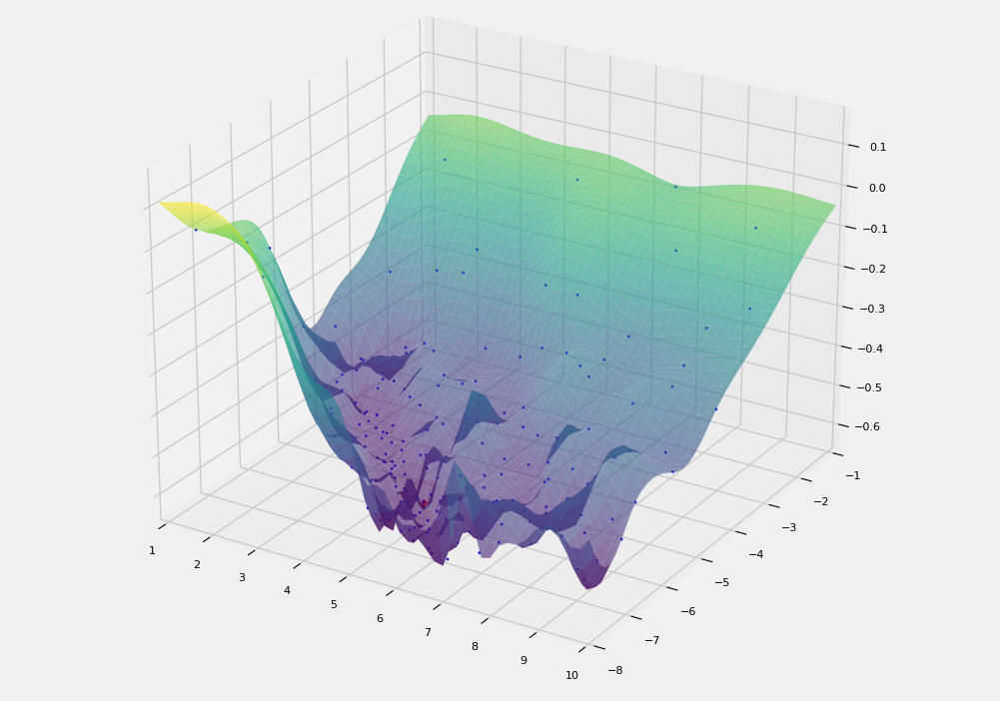

Examples of using
=====================

Tuning the parameters of a genetic algorithm to solve the traveling salesman problem
____________________________________________________________________________________

Traveling Salesman Problem (TSP) is an NP-hard combinatorial optimization problem, important 
in theoretical computer science and operations research. The essence of the problem statement 
can be formulated as follows: "For a given list of cities and distances find the shortest route 
between each pair of cities, which passes through each city exactly once and returns to the home 
city."

Problem statement
~~~~~~~~~~~~~~~~~~~~~~~~~~~~~~~~

Let the numbers :math:`1,2,{\dots},n` correspond to cities, the values :math:`c_{\mathit{ij}}>0` 
correspond to the distances between the cities :math:`i` and :math:`j`, and the value :math:`x_{\mathit{ij}}=1`,
if there is a path from :math:`i` to :math:`j`, and :math:`x_{\mathit{ij}}=0` otherwise.
Then the travelling salesman problem can be formulated as follows:

.. math::

   \min\sum _{i=1}^n\sum _{i{\neq}j,j=1}^nc_{\mathit{ij}}x_{\mathit{ij}}:

.. math::

   \sum _{i=1,i{\neq}j}^nx_{\mathit{ij}}=1,\sum _{j=1,i{\neq}j}^nx_{\mathit{ij}}=1,i=1,{\dots},n;j=1,{\dots},n;

.. math::

   \sum _{i{\in}Q}^n\sum_{i{\neq}j,j{\in}Q}^nx_{\mathit{ij}}{\leq}\left|Q\right|-1,{\forall}Q{\subsetneq}\left\{1,{\dots},n\right\},\left|Q\right|{\geq}2.

The last constraint ensures that no subset of Q can form a subroute, so the solution returned is 
a single route, not a union of smaller routes.

Known methods for solving TSP
~~~~~~~~~~~~~~~~~~~~~~~~~~~~~

There are many algorithms to obtain the optimal distance to be travelled by the salesman: 
exhaustive search, random search, nearest neighbour method, cheapest inclusion method, 
minimum spanning tree method, branch and bound method. We will consider the application 
of a genetic algorithm for solving TSP.

Framework for solving TSP
~~~~~~~~~~~~~~~~~~~~~~~~~

We used `scikit-opt <https://github.com/guofei9987/scikit-opt>`_ as a framework for solving TSP 
using the genetic algorithm. 
This framework is often used in scientific research, has a good structure, documentation 
and technical support. In particular, scikit-opt implements a genetic algorithm for solving 
the travelling salesman problem. This method is called **GA_TSP** and has the following parameters:

* **func**: function for calculating the length of the travelling salesman's path;
* **n_dim**: number of vertices considered in the problem;
* **size_pop**: population size;
* **max_iter**: number of iterations of the genetic algorithm;
* **prob_mut**: probability of occurrence of a mutation.

Parameter optimization problem statement
~~~~~~~~~~~~~~~~~~~~~~~~~~~~~~~~~~~~~~~~

Obviously, with different sets of values for the population size, 
the maximum number of iterations of the algorithm, and the probability 
of a mutation occurring, the genetic algorithm will produce different solutions. 
It is required to find such a set of algorithm parameters that will provide 
the best solution with a limited resource of iterations.

Initial data
~~~~~~~~~~~~

The **GA_TSP** method from the scikit-opt library accepts an objective function 
for calculating the length of the traveling salesman’s route as one of the parameters. 
This function processes the initial data. 
The data itself is presented in a matrix, where the intersection of the :math:`i`-th row and 
the :math:`j`-th column of the matrix is the distance between the cities :math:`i` and :math:`j`.

The `TSPLIB <http://comopt.ifi.uni-heidelberg.de/software/TSPLIB95/>`_ portal
contains the well-known matrix database for travelling salesman problems in XML format. 
As an input to the method, the path to the xml-file pre-loaded from TSPLIB is provided.

.. code-block::
   :caption: Converting an XML file with vertex distances to a two-dimensional numpy array

   import xml.etree.ElementTree as ET
   import numpy as np

   def load_TSPs_matrix(file_name):
      root = ET.parse(file_name).getroot()
      columns = root.findall('graph/vertex')
      num_cols = len(columns)
      trans_matrix = np.zeros((num_cols, num_cols))
      for i, v in enumerate(columns):
         for e in v:
               j = int(e.text)
               trans_matrix[i, j] = float(e.get('cost'))
      return trans_matrix

Finding the optimal path for fixed parameter values
~~~~~~~~~~~~~~~~~~~~~~~~~~~~~~~~~~~~~~~~~~~~~~~~~~~

Consider working with the **GA_TSP** method of the Scikit-opt library. 
Before starting, let’s load the att48.xml task from the open TSPLIB task bank.

First, we define the objective function for calculating the distance of the current 
travelling salesman route. The **calc_total_distance** function is used to calculate 
the distance between the vertices specified in the **routine** array, 
the input parameter of this function.

Next, we initialize the object designed to store the service information of 
the genetic algorithm for solving the travelling salesman problem. 
In particular, we call the **GA_TSP** class constructor and specify the parameters:

* set the **func** parameter to the objective function **calc_total_distance**;
* the **n_dim** parameter stores information about the number of nodes in the distance matrix, 
  so we use the dimension of the matrix to initialize it;
* the **size_pop** parameter is initialized with the starting value 50 (we take into account 
  that it is necessary to specify the population size as a multiple of two);
* the probability of mutation (**prob_mut**) and the iterations number of 
  the genetic algorithm (**max_iter**) are set to 100 and 0.9, respectively.

To run the method for finding the minimum distance for an object of the **GA_TSP** class, 
one must call the **run** method. Upon completion of the work, the specified method returns 
the optimal trajectory and the corresponding value of the distance traveled.
The result obtained with the current parameters is 16237.

.. code-block::
   :caption: An example of working with the scikit-opt library to find a solution 
             to the traveling salesman problem using a genetic algorithm

   import xml.etree.ElementTree as ET
   import numpy as np
   from sko.GA import GA_TSP

   def load_TSPs_matrix(file_name):
      root = ET.parse(file_name).getroot()
      columns = root.findall('graph/vertex')
      num_cols = len(columns)
      trans_matrix = np.zeros((num_cols, num_cols))
      for i, v in enumerate(columns):
         for e in v:
               j = int(e.text)
               trans_matrix[i, j] = float(e.get('cost'))
      return trans_matrix

   def cal_total_distance(routine):
      num_points, = routine.shape
      return sum([trans_matr[routine[i % num_points], routine[(i + 1) % num_points]] for i in range(num_points)])

   trans_matr = load_TSPs_matrix('att48.xml')
   num_cols = trans_matr.shape[0]
   ga_tsp = GA_TSP(func=cal_total_distance, n_dim=num_cols, size_pop=50, max_iter=100, prob_mut=0.9)
   best_points, best_distance = ga_tsp.run()

Finding the optimal path when tuning the probability of mutation using the iOpt framework
~~~~~~~~~~~~~~~~~~~~~~~~~~~~~~~~~~~~~~~~~~~~~~~~~~~~~~~~~~~~~~~~~~~~~~~~~~~~~~~~~~~~~~~~~

To solve the travelling salesman problem by means of a genetic algorithm, for the iOpt framework, 
we have developed classes focused on finding the best trajectory and minimum distance, by redefining 
the base class **Problem**.

The **GA_TSP_Vary_Mutation** class assumes as input parameters the distance matrix, 
the number of iterations of the genetic algorithm, the population size, and 
the bounds on the variation of the mutation probability.

The class implements an objective function for calculating the total distance between vertices, 
as well as a function for calculating the current distance for fixed user-specified values 
of the number of iterations of the genetic algorithm and the population size. 
The **Calculate** method returns the path length found by the genetic algorithm for a fixed value 
of the population size, the number of iterations, and a variable value of the mutation probability.

.. code-block::
   :caption: Adaptation of a genetic algorithm for the traveling salesman problem

   import numpy as np
   from sko.GA import GA_TSP
   from typing import Dict

   class GA_TSP_Vary_Mutation(Problem):
      def __init__(self, cost_matrix: np.ndarray, num_iteration: int,
                  population_size: int,
                  mutation_probability_bound: Dict[str, float]):
         self.dimension = 1
         self.number_of_float_variables = 1
         self.number_of_discrete_variables = 0
         self.number_of_objectives = 1
         self.number_of_constraints = 0
         self.costMatrix = cost_matrix
         if num_iteration <= 0:
               raise ValueError('The number of iterations cannot be zero or negative.')
         if population_size <= 0:
               raise ValueError('Population size cannot be negative or zero')
         self.populationSize = population_size
         self.numberOfIterations = num_iteration
         self.float_variable_names = np.array(["Mutation probability"],
               dtype=str)
         self.lower_bound_of_float_variables =
               np.array([mutation_probability_bound['low']], dtype=np.double)
         self.upper_bound_of_float_variables =
               np.array([mutation_probability_bound['up']], dtype=np.double)
         self.n_dim = cost_matrix.shape[0]

      def calc_total_distance(self, routine):
         num_points, = routine.shape
         return sum([self.costMatrix[routine[i % num_points], 
               routine[(i + 1) % num_points]] for i in range(num_points)])

      def Calculate(self, point: Point, 
                     functionValue: FunctionValue) -> FunctionValue:
         mutation_prob = point.float_variables[0]
         ga_tsp = GA_TSP(func=self.calc_total_distance,
                         n_dim=self.n_dim, size_pop=self.populationSize,
                         max_iter=self.numberOfIterations, 
                         prob_mut=mutation_prob)
         best_points, best_distance = ga_tsp.run()
         functionValue.value = best_distance[0]
         return functionValue

Below is the code to run the solver of the iOpt framework:

#. loading data from xml file;
#. setting the values of the method iteration number and population size;
#. setting limits for varying mutation probability values;
#. initialization of the problem under study;
#. setting solver parameters;
#. starting the solution process - searching for the optimal distance value.

.. code-block::
   :caption: An example of choosing the optimal parameter GA_TSP using the iOpt framework solver

   import numpy as np
   import xml.etree.ElementTree as ET

   def load_TSPs_matrix(file_name):
      root = ET.parse(file_name).getroot()
      columns = root.findall('graph/vertex')
      num_cols = len(columns)
      trans_matrix = np.zeros((num_cols, num_cols))
      for i, v in enumerate(columns):
         for e in v:
               j = int(e.text)
               trans_matrix[i, j] = float(e.get('cost'))
      return trans_matrix

   if __name__ == "__main__":
      tsp_matrix = load_TSPs_matrix('att48.xml')
      num_iteration = 100
      population_size = 50
      mutation_probability_bound = {'low': 0.0, 'up': 1.0}
      problem = ga_tsp_vary_mutation.GA_TSP_Vary_Mutation(tsp_matrix,
         num_iteration, population_size, mutation_probability_bound)
      method_params = SolverParameters(r=np.double(3.0), iters_limit=20)
      solver = Solver(problem, parameters=method_params)

      solver_info = solver.Solve()

Results
~~~~~~~

When solving TSP using a genetic algorithm tuned by iOpt, it was possible to find 
a better estimate of the optimum than that obtained using the same algorithm tuned 
by means of the uniform grid technique. The distance found using iOpt was 13333, 
while 35 calls to the objective function were made. At the same time, the solution 
with the parameters found by the uniform grid technique was 13958; in this case, 
100 calls to the objective function were made.

.. figure:: images/gatsp.png
   :width: 500
   :align: center

   Demonstration of how the iOpt framework works when setting up the parameters of the traveling salesman problem

Tuning support vector machine hyperparameters for a classification problem in machine learning
______________________________________________________________________________________________

In machine learning problems, in order to obtain a high-quality prediction it is necessary 
to optimize the hyperparameters of the model. 
We consider the support vector machine (SVC_) - a method for constructing a separating surface. 

.. _SVC: https://scikit-learn.org/stable/modules/generated/sklearn.svm.SVC.html

The method has two real parameters: the regularization coefficient (C) and the kernel coefficient (gamma). 
The task is as follows: to select the hyperparameters of the model to maximize the objective metric.

Dataset used
~~~~~~~~~~~~

We will use the `breast cancer_` dataset. The dataset includes 569 examples, each with 30 
numerical characteristics. Characteristics are calculated from a digitized fine needle aspiration 
(FNA) image of the breast mass. They describe the characteristics of the nuclei of the cells present 
in the image. The distribution by class is as follows: 212 malignant, 357 benign tumors.

.. _`breast cancer`: https://archive.ics.uci.edu/ml/datasets/Breast+Cancer+Wisconsin+(Diagnostic) 

Solving the problem with default parameters
~~~~~~~~~~~~~~~~~~~~~~~~~~~~~~~~~~~~~~~~~~~

Let's solve the classification problem using the SVC_ method with the hyperparameters that 
the scikit-learn framework uses by default. The code includes loading a shuffled dataset 
with a fixed random_state, as well as applying cross-validation.

.. _SVC: https://scikit-learn.org/stable/modules/generated/sklearn.svm.SVC.html

.. code-block::
    :caption: Solving the problem with default parameters

    from sklearn.model_selection import cross_val_score
    from sklearn.metrics import f1_score
    from sklearn.svm import SVC

    def get_sklearn_breast_cancer_dataset():
        dataset = load_breast_cancer()
        x, y = dataset['data'], dataset['target']
        return shuffle(x, y ^ 1, random_state=42)

    x, y = get_sklearn_breast_cancer_dataset()

    cross_val_score(SVC(), x, y,
                    scoring=lambda model, x, y: f1_score(y, model.predict(x))).mean()

With the default hyperparameters, we solved the problem with an average f1-score 
across all cross-validation experiments of 0.87.

Calculation of the averaged f1-score on a grid
~~~~~~~~~~~~~~~~~~~~~~~~~~~~~~~~~~~~~~~~~~~~~~

Let us see if this problem can be solved better by varying two continuous parameters of the algorithm. 
To do this, we calculate the average value of cross-validation at each point of a uniform 20 by 20 grid:

#. regularization parameter **C**: [10\ :sup:`1`, 10\ :sup:`6`];
#. kernel coefficient **gamma**: [10\ :sup:`-7`, 10\ :sup:`-3`].

For convenience, we use a logarithmic scale and the **np.logspace** function to obtain 
the corresponding grid values.

.. code-block::
    :caption: Calculating f1-score value on a 20x20 grid

    import numpy as np

    cs = np.logspace(1, 6, 20)
    gamms = np.logspace(-7, -3, 20)

    params = {'C': cs, 'gamma': gamms}

    search = GridSearchCV(SVC(), cv=5, param_grid=params, 
                        scoring=lambda model, x, y: f1_score(y, model.predict(x)))
    search.fit(x, y)

Let's display the results of the experiment on a graph. To reduce the maximization problem 
to a minimization problem, we multiply the objective value by minus one.

.. figure:: images/cancer_svc_f1.png
    :width: 500
    :align: center

    Average f1-score values on the grid

It can be seen from the graph that there are SVC hyperparameters that solve the problem 
with an average value of 0.94 f1-score, which significantly improves the quality of prediction.

Finding optimal parameters using the iOpt framework
~~~~~~~~~~~~~~~~~~~~~~~~~~~~~~~~~~~~~~~~~~~~~~~~~~~

An example of working with the framework when varying two continuous parameters
""""""""""""""""""""""""""""""""""""""""""""""""""""""""""""""""""""""""""""""" 
Let’s run the iOpt framework to find the optimal point on the grid, maximizing the f1-score. 
To do this, we will declare a class that is a successor of the **Problem** class 
with an abstract **Calculate** method.

.. code-block:: 

    import numpy as np
    from iOpt.trial import Point
    from iOpt.trial import FunctionValue
    from iOpt.problem import Problem
    from sklearn.metrics import f1_score
    from sklearn.svm import SVC
    from sklearn.model_selection import cross_val_score
    from typing import Dict

    class SVC_2D(Problem):
        def __init__(self, x_dataset: np.ndarray, y_dataset: np.ndarray,
                    regularization_bound: Dict[str, float],
                    kernel_coefficient_bound: Dict[str, float]):
            
            self.dimension = 2
            self.number_of_float_variables = 2
            self.number_of_discrete_variables = 0
            self.number_of_objectives = 1
            self.number_of_constraints = 0
            if x_dataset.shape[0] != y_dataset.shape[0]:
                raise ValueError('The input and output sample sizes do not match.')
            self.x = x_dataset
            self.y = y_dataset
            self.float_variable_names = np.array(["Regularization parameter",
                "Kernel coefficient"], dtype=str)
            self.lower_bound_of_float_variables =
                np.array([regularization_bound['low'], 
                kernel_coefficient_bound['low']], dtype=np.double)
            self.upper_bound_of_float_variables =
                np.array([regularization_bound['up'], 
                kernel_coefficient_bound['up']], dtype=np.double)

        def Calculate(self, point: Point, 
                      functionValue: FunctionValue) -> FunctionValue:
            cs, gammas = point.float_variables[0], point.float_variables[1]
            clf = SVC(C=10**cs, gamma=10**gammas)
            clf.fit(self.x, self.y)
            functionValue.value = -cross_val_score(clf, self.x, self.y,
                scoring=lambda model, x, y: f1_score(y, model.predict(x))).mean()
            return functionValue

The SVC_2D class accepts the following constructor parameters:

#. **x_dataset** – an array of objects and their attributes wrapped in **np.ndarray**;
#. **y_dataset** – target labels of each of the **x_dataset** objects in the **np.ndarray** format;
#. **regularization_bound** – maximum and minimum values for **C** as a dictionary;
#. **kernel_coefficient_bound** – maximum and minimum values for **gamma** as a dictionary.

The **Calculate**  method implements the logic of calculating the objective function at **Point**. 
To do this, an SVC classifier is created and trained with the passed hyperparameters, 
then the average value of f1-score by cross-validation is calculated with the opposite sign.

To start the optimization process, we created an object of the **SVC_2D class**, as well as 
an object of the **Solver** class with the passed objective function object. 
To render, we called the **AddListener** method, passing objects of the **AnimationNDPaintListener** 
and **StaticNDPaintListener** classes.

.. code-block:: python
    :caption: Running optimization of the SVC_2D object serving as the objective function

    from iOpt.method.listener import StaticNDPaintListener, AnimationNDPaintListener
    from sklearn.datasets import load_breast_cancer
    from iOpt.solver import Solver
    from iOpt.solver_parametrs import SolverParameters
    from examples.Machine_learning.SVC._2D.Problems import SVC_2d

    if __name__ == "__main__":
        x, y = load_breast_cancer_data()
        regularization_value_bound = {'low': 1, 'up': 6}
        kernel_coefficient_bound = {'low': -7, 'up': -3}

        problem = SVC_2d.SVC_2D(x, y, regularization_value_bound, 
            kernel_coefficient_bound)

        method_params = SolverParameters(r=np.double(3.0), iters_limit=10)
        solver = Solver(problem, parameters=method_params)

        apl = AnimationNDPaintListener("svc2d_anim.png", "output", 
            vars_indxs=[0, 1], to_paint_obj_func=False)
        solver.AddListener(apl)

        spl = StaticNDPaintListener("svc2d_stat.png", "output", vars_indxs=[0, 1],
            mode="surface", calc="interpolation")
        solver.AddListener(spl)

        solver_info = solver.Solve()
        print(solver_info.number_of_global_trials)
        print(solver_info.number_of_local_trials)
        print(solver_info.solving_time)

        print(solver_info.best_trials[0].point.float_variables)
        print(solver_info.best_trials[0].function_values[0].value)

After the experiment, the program displays the total search time for the optimum, 
the point on the grid at which the optimum is reached, the found maximum value of the f1-score metric, 
and also the graph of the objective function.

With a limit on the number of iterations **iterLimits**=10, the framework finds hyperparameters 
where the target metric reaches 0.94, the total calculation time is less than 5 seconds.

For visual interpolation of the graph, the parameter **iterLimits**=100 was set.

.. figure:: images/cancer_iopt_interpol.png
   :width: 500
   :align: center

   Objective function interpolation

The blue dots on the graph represent the points of exploratory trials, 
the red dot marks the found optimum corresponding to the hyperparameters 
at which the f1-score reaches its maximum.

An example of working with the framework when varying two continuous and one discrete parameters
"""""""""""""""""""""""""""""""""""""""""""""""""""""""""""""""""""""""""""""""""""""""""""""""" 
Previously, when searching for the optimal set of parameters, an example was considered 
with varying two continuous parameters of the SVC method.
As a target discrete parameter, we will select the type of algorithm kernel: **kernel**. 
This categorical parameter takes one of 5 values: linear, poly, rbf, sigmoid, precomputed.
However, when considering the parameters C and gamma, only three of them are available: 
poly, rbf, sigmoid.

Let's consider the behavior of the quality metric f1-score on each specified core separately. 
Let's set the following areas for parameters:

#. regularization parameter **C**: [10\ :sup:`1`, 10\ :sup:`10`];
#. kernel coefficient **gamma**: [10\ :sup:`-9`, 10\ :sup:`-6.7`].

When running on a uniform grid of 40 by 40 points with the rbf kernel type, 
it is clear that the graph has several local minima.
With this search, the optimal metric value was found equal to -0.949421.

.. figure:: images/rbf_kernel.JPG
   :width: 500
   :align: center

   Graph of f1-score metric values on a specified area with kernel = rbf

When changing the kernel type from rbf to sigmoid, the graph changed, 
but still has a multi-extreme nature.
The minimum metric value on the specified grid is -0.93832.

.. figure:: images/sigmoid_kernel.JPG
   :width: 500
   :align: center

   Graph of f1-score metric values on a specified area with kernel = sigmoid

When studying the behavior of the metric graph on a uniform grid with a poly kernel, 
weak multiextremality is observed.
However, the minimum value of the metric was not found, and the method stopped at the value -0.9337763.

.. figure:: images/poly_kernel.JPG
   :width: 500
   :align: center

   Graph of f1-score metric values on a specified area with kernel = poly

When varying the kernel type for the SVC algorithm, different metric values are observed. 
Thus, it becomes possible to explore the behavior of the metric using the iOpt framework, 
varying the parameters **C**, **gamma** and **kernel** in the specified area.

Let's prepare a problem to solve. To do this, as in the two-dimensional case, 
it is necessary to declare a class that is a descendant of the **Problem** class 
with the abstract **Calculate** method. The code for this class is presented below:

.. code-block:: python

   class SVC_3D(Problem):
      def __init__(self, x_dataset: np.ndarray, y_dataset: np.ndarray,
                  regularization_bound: Dict[str, float],
                  kernel_coefficient_bound: Dict[str, float],
                  kernel_type: Dict[str, List[str]]
                  ):
         super(SVC_3D, self).__init__()
         self.dimension = 3
         self.number_of_float_variables = 2
         self.number_of_discrete_variables = 1
         self.number_of_objectives = 1
         self.number_of_constraints = 0
         if x_dataset.shape[0] != y_dataset.shape[0]:
               raise ValueError('The input and output sample sizes do not match.')
         self.x = x_dataset
         self.y = y_dataset
         self.float_variable_names = np.array(["Regularization parameter", "Kernel coefficient"], dtype=str)
         self.lower_bound_of_float_variables = np.array([regularization_bound['low'], kernel_coefficient_bound['low']],
                                                      dtype=np.double)
         self.upper_bound_of_float_variables = np.array([regularization_bound['up'], kernel_coefficient_bound['up']],
                                                      dtype=np.double)
         self.discrete_variable_names.append('kernel')
         self.discrete_variable_values.append(kernel_type['kernel'])

      def Calculate(self, point: Point, functionValue: FunctionValue) -> FunctionValue:
         cs, gammas = point.float_variables[0], point.float_variables[1]
         kernel_type = point.discrete_variables[0]
         clf = SVC(C=10 ** cs, gamma=10 ** gammas, kernel=kernel_type)
         functionValue.value = -cross_val_score(clf, self.x, self.y, scoring='f1').mean()
         return functionValue

The SVC_3D class accepts the following constructor parameters:

#. **x_dataset** – an array of objects and their attributes wrapped in **np.ndarray**;
#. **y_dataset** – target labels of each of the **x_dataset** objects in the **np.ndarray** format;
#. **regularization_bound** – maximum and minimum values for **C** as a dictionary;
#. **kernel_coefficient_bound** – maximum and minimum values for **gamma** as a dictionary.
#. **kernel_type** – the kernel type used in the SVC algorithm.

The **Calculate** method implements the logic for calculating the objective function 
at the **Point** point. It is worth noting that the **Point** contains two real parameters 
and one discrete one, which are used to train the SVC classifier.
To obtain the value of the optimized function, the average f1-score value is calculated 
based on cross-validation.

To start the optimization process, you need to create an object of the **SVC_3D** class, 
as well as an object of the **Solver** class with the passed target function object.

When searching for the optimal combination of discrete and continuous parameters, 
the following areas were considered:

#. regularization parameter **C**: [10\ :sup:`1`, 10\ :sup:`10`];
#. kernel coefficient **gamma**: [10\ :sup:`-9`, 10\ :sup:`-6.7`];
#. kernel type **kernel**: [rbf, sigmoid, poly].

To perform the prepared problem, a script has been developed in which the previously specified area 
is set to search for the optimal combination of hyperparameters. As part of the script, data is loaded 
on which the operation of the SVC algorithm is analyzed. Listeners have been added to the script, 
which provide additional information about the search process. Thus, **ConsoleOutputListener** allows 
you to track the process of searching for the optimal set of hyperparameters, visualizing test points 
and metric values at a given point in the console.
**StaticDiscreteListener** with mode='analysis' provides summary statistics in graphical form
according to the study, which displays:

* Graph of the dependence of the value of the objective function on the number of tests
* The metric value at each iteration depending on the selected value of the discrete parameter
* Graph of the minimum values of the objective function at each iteration
* Values of the objective function when using a specific value of the discrete parameter

.. figure:: images/statictic.JPG
   :width: 500
   :align: center

   Statistics on finding the optimal combination of parameters using iOpt

**StaticDiscreteListener** with mode='bestcombination' visualizes level lines that correspond 
to the graph with the value of the discrete parameter at which the optimum for the metric was found. 
The blue dots on the graph indicate the test points of the solver for the best value 
of the discrete parameter, and the gray dots indicate all the others. The red dot is 
the found minimum value of the objective function.

   Level lines of the graph corresponding to the function with the “best” value of the discrete parameter

.. code-block:: 
    :caption: Script for finding the optimal combination of hyperparameters
.. code-block:: 
   
   from iOpt.output_system.listeners.console_outputers import ConsoleOutputListener
   from iOpt.output_system.listeners.static_painters import StaticDiscreteListener
   from sklearn.datasets import load_breast_cancer
   from iOpt.solver import Solver
   from iOpt.solver_parametrs import SolverParameters
   from examples.Machine_learning.SVC._3D.Problem import SVC_3D
   from sklearn.utils import shuffle

   def load_breast_cancer_data():
      dataset = load_breast_cancer()
      x_raw, y_raw = dataset['data'], dataset['target']
      inputs, outputs = shuffle(x_raw, y_raw ^ 1, random_state=42)
      return inputs, outputs

   if __name__ == "__main__":
      x, y = load_breast_cancer_data()
      regularization_value_bound = {'low': 1, 'up': 10}
      kernel_coefficient_bound = {'low': -9, 'up': -6.7}
      kernel_type = {'kernel': ['rbf', 'sigmoid', 'poly']}
      problem = SVC_3D.SVC_3D(x, y, regularization_value_bound, kernel_coefficient_bound, kernel_type)
      method_params = SolverParameters(iters_limit=400)
      solver = Solver(problem, parameters=method_params)
      apl = StaticDiscreteListener("experiment1.png", mode='analysis')
      solver.AddListener(apl)
      apl = StaticDiscreteListener("experiment2.png", mode='bestcombination', calc='interpolation', mrkrs=4)
      solver.AddListener(apl)
      cfol = ConsoleOutputListener(mode='full')
      solver.AddListener(cfol)
      solver_info = solver.Solve()

During the work of the framework, a minimum f1-score was found equal to **-0.95157487**. 
Number of solver iterations **iterLimits**=400.

Tuning hyperparameters of the support vector machine for the problem of classifying the state of the air pressure system of trucks
__________________________________________________________________________________________________________________________________

The use of machine learning methods is relevant not only in medicine, but also in industry. 
From an algorithmic point of view, the solution of the problem of classifying the state 
of machine units or the quality of manufactured products does not differ from the classification 
of neoplasms and human conditions. Let’s demonstrate the work of the iOpt framework when tuning 
the hyperparameters (regularization coefficient **C** and kernel coefficient **gamma**) of 
the support vector machine (SVC) in order to maximize the f1-score metric.

Dataset used
~~~~~~~~~~~~

We will use an industrial data set that describes failures in the compressed air supply system 
for Scania_ trucks: braking system, gearshift system, etc.
The initial data consists of 60,000 samples, with each sample characterized by a set of 171 attributes. 

.. _Scania:  http://archive.ics.uci.edu/ml/datasets/IDA2016Challenge

There are two classes in the dataset:

#. the Positiv class characterizes a sample in which, by the combination of attributes, 
   it is possible to establish a failure of the compressed air injection system;
#. the Negative class characterizes the system in which a failure has occurred that is not related 
   to the compressed air injection system.

The attributes in the data set are de-identified in order to respect the confidentiality 
of the characteristics of the Scania truck system. Some of the table cells have an undefined value. 
The data set contains 59 thousand samples, whose set of attributes describes the failure of 
the APS (air pressure system), and one thousand samples describing the failure of other systems. 
In further experiments (to obtain a result in a reasonable time), we will use a subset 
of the initial data consisting of two thousand samples.

Solving the problem with default parameters
~~~~~~~~~~~~~~~~~~~~~~~~~~~~~~~~~~~~~~~~~~~

Let's solve the classification problem using the SVC_ method from the scikit-learn package. 
We will use the default hyperparameters.

.. _SVC: https://scikit-learn.org/stable/modules/generated/sklearn.svm.SVC.html

.. code-block::
   :caption: Solving the problem with default parameters

   from sklearn.model_selection import cross_val_score
   from sklearn.metrics import f1_score
   from sklearn.svm import SVC
   import pandas as pd

   def get_SCANIA_dataset():
      xls = pd.read_excel(r"aps_failure_training_set1.xls", header=None)
      data = xls.values[1:]
      row, col = data.shape
      _x = data[:,1:col]
      _y = data[:, 0]
      y = np.array(_y, dtype=np.double)
      x = np.array(_x, dtype=np.double)
      return shuffle(x, y, random_state=42)

   X, Y = get_SCANIA_dataset()
   x = X[:2000]
   y = Y[:2000]

   model = Pipeline([('scaler', StandardScaler()), ('model', SVC())])
   cross_val_score(model, x, y, cv=3, scoring="f1").mean()

With the default hyperparameters, we solved the problem with an average f1-score over all 
cross-validation experiments of 0.1068376. 

Calculation of the averaged f1-score on a grid
~~~~~~~~~~~~~~~~~~~~~~~~~~~~~~~~~~~~~~~~~~~~~~

Let's make sure that this problem can be solved better by varying two continuous parameters 
of the algorithm. To do this, we calculate the average value of cross-validation at each point 
of a uniform 20 by 20 grid:

#. regularization parameter **C**: [10\ :sup:`1`, 10\ :sup:`10`];
#. kernel coefficient **gamma**: [10\ :sup:`-8`, 10\ :sup:`-1`].

For convenience, we use a logarithmic scale and the **np.logspace** function to obtain 
the corresponding grid values.

.. code-block::
   :caption: Solving the problem with default parameters

   import numpy as np

   model = Pipeline([('scaler', StandardScaler()), ('model', SVC())])

   cs = np.logspace(1, 10, 20)
   gamms = np.logspace(-8, -1, 20)

   params = {'model__C': cs, 'model__gamma': gamms}

   search = GridSearchCV(model, cv=3, param_grid=params, scoring='f1')
   search.fit(x, y)

Let’s display the results of the experiment on a graph. To reduce the maximization problem 
to a minimization problem, we multiply the objective function by minus one.

.. figure:: images/scania_svc_f1.png
    :width: 800
    :align: center
    
    Graph of average f1-score on a 20x20 grid for the APS failure problem

Finding optimal parameters using the iOpt framework
~~~~~~~~~~~~~~~~~~~~~~~~~~~~~~~~~~~~~~~~~~~~~~~~~~~

Let's launch the iOpt framework to find the optimal hyperparameters of the SVC method 
that minimize the f1-score. To do this, one must declare a class that is a successor 
of the **Problem** class with an abstract **Calculate** method.

To start the optimization process, it is necessary to create an object of the **SVC_2D** class, 
as well as an object of the **Solver** class with the passed objective function object. 
To render the results, we called the **AddListener** method, passing objects 
of the **AnimationNDPaintListener** and **StaticNDPaintListener** classes.

.. code-block::
   :caption: Running optimization of the SVC_2D object serving as the objective function

   from iOpt.method.listener import StaticNDPaintListener, AnimationNDPaintListener, ConsoleFullOutputListener
   from iOpt.solver import Solver
   from iOpt.solver_parametrs import SolverParameters
   from examples.Machine_learning.SVC._2D.Problems import SVC_2d
   from sklearn.utils import shuffle
   import numpy as np
   import pandas as pd

   def get_SCANIA_dataset():
      xls = pd.read_excel(r"../Datasets/aps_failure_training_set1.xls", header=None)
      data = xls.values[1:]
      row, col = data.shape
      _x = data[:, 1:col]
      _y = data[:, 0]
      y = np.array(_y, dtype=np.double)
      x = np.array(_x, dtype=np.double)
      return shuffle(x, y, random_state=42)

   if __name__ == "__main__":
      X, Y = get_SCANIA_dataset()
      x = X[:2000]
      y = Y[:2000]
      regularization_value_bound = {'low': 1, 'up': 10}
      kernel_coefficient_bound = {'low': -8, 'up': -1}
      problem = SVC_2d.SVC_2D(x, y, regularization_value_bound, kernel_coefficient_bound)
      method_params = SolverParameters(r=np.double(2.0), iters_limit=200)
      solver = Solver(problem, parameters=method_params)
      apl = AnimationNDPaintListener(vars_indxs=[0, 1], to_paint_obj_func=False)
      solver.AddListener(apl)
      spl = StaticNDPaintListener(vars_indxs=[0, 1], mode="surface", calc="interpolation")
      solver.AddListener(spl)
      cfol = ConsoleFullOutputListener(mode='full')
      solver.AddListener(cfol)
      solver_info = solver.Solve()

After the experiment, the program displays the total search time for the optimum, 
the point at which the optimum is reached, the found optimal value of the f1-score metric, 
as well as the graph of the objective function based on the points of the search trials. 
With a limit on the number of iterations **iterLimits**=200, the framework finds hyperparameters 
where the target metric reaches 0.5723, the total calculation time is less than 1 minute.

    
    Graph of the objective function based on test points

The blue dots on the graph represent the points of exploratory trials, the red dot marks 
the found optimum corresponding to the hyperparameters at which the value of f1-score reaches a minimum.

To compare the quality of work, experiments were carried out on the same data set using 
the well-known Scikit-Optimize framework.

.. code-block::
   :caption: Starting the search for the optimal value of f1-score using the Scikit-Optimize framework methods

   from skopt.space import Real
   from skopt.utils import use_named_args
   import skopt

   space  = [Real(1e1, 1e10, name='C'),
            Real(1e-8, 1e-1, name='gamma')]

   @use_named_args(space)
   def objective(**p):
      model = Pipeline([('scaler', StandardScaler()), ('model', SVC(**p))])
      return -np.mean(cross_val_score(model, x, y, scoring='f1'))

   results = skopt.gbrt_minimize(objective, space, n_calls=500)
   print(results.fun)

Over 500 iterations, the Scikit-Optimize framework found a combination of parameters that provides 
a solution to the classification problem with f1-score value of 0.4492, which is 21% worse than 
the optimal value obtained using iOpt over 200 iterations.

Tuning hyperparameters in the problem of predicting the concentration of nitrogen oxide in the working area of a gas turbine
____________________________________________________________________________________________________________________________
Gas turbines are promising power plants for generating electrical and thermal energy. Their use makes it possible to increase the efficiency of power stations. However, when operating a gas turbine unit, it is necessary to fulfill a number of requirements for maintaining a given power, environmental friendliness, vibration, noise, etc. Thus, the degree of danger of air pollution with carbon and nitrogen oxides is extremely high and depends on the parameters of energy generation. The concentration of emissions is carefully monitored by law enforcement agencies, and exceeding the standards leads to the payment of fines. In this regard, it is necessary to control the amount of harmful emissions by selecting optimal generator operating parameters.

Dataset
~~~~~~~
The dataset contains information from sensors located near the gas turbine to study flue gas emissions, namely :math:`CO` and :math:`NO_{\mathit{x}}` (:math:`NO+NO_{\mathit{2}}`). The dataset contains 36733 instances of measurements from 11 sensors collected in one hour. The data is sorted in chronological order. There are no empty cells or cells with an undefined value.

Solving the problem on a uniform grid
~~~~~~~~~~~~~~~~~~~~~~~~~~~~~~~~~~~~~~
The problem of predicting the concentration of nitrogen oxide in the working area of a turbine based on the collected dataset is considered. To solve this problem, we used the XGBRegressor method from the xgboost library.

The listing below shows the code for loading a dataset and then shuffling it.

.. code-block:: python
   :caption: Solving the problem on a uniform grid

   import numpy as np
   from sklearn.model_selection import GridSearchCV
   from sklearn.model_selection import cross_val_score
   from sklearn.utils import shuffle
   import csv
   from sklearn.metrics import r2_score
   import xgboost as xgb

   def gasturbine_Dataset():
      x = []
      y = []
      with open("no_predict.csv") as file:
         file_reader = csv.reader(file, delimiter = ";")
         for row in file_reader:
               x_row = []
               for i in range(len(row)-1):
                  x_row.append(row[i])
               x.append(x_row)
               y.append(row[len(row)-1])
      return shuffle(np.array(x, dtype=np.float32), np.array(y, dtype=np.float32), random_state=42)

   x, y = gasturbine_Dataset()

We used :math:`R^2` as the target metric. The metric values are in the range [0, 1], which makes the display of the results more visual: the value 0 means that the model will work poorly with an unknown data set; if the value of :math:`R^2` is 1, the model is ideal. This also means that the closer the :math:`R^2` score is to 1, the more accurately the model is trained. The optimal value of the objective function , equal to 0.8598, was found at the point learning_rate = 0.2974359, gamma = 0.2974359, when varying the parameters gamma (minimum loss reduction) and learning_rate (learning rate), in the range [0.2, 0.3] and [0.2, 0.4], respectively, on a uniform grid of 40 by 40 points.

The search was performed using the GridSearchCV method from the sklearn library. The cross-validation parameter was set to 5, which is the default value. The code of the program that searches for the optimum on a uniform grid is presented in the listing below.

.. code-block:: python
   :caption: Solving the problem on a uniform grid

   import numpy as np
   from sklearn.model_selection import GridSearchCV
   from sklearn.model_selection import cross_val_score
   from sklearn.utils import shuffle
   import csv
   from sklearn.metrics import r2_score
   import xgboost as xgb

   gamma = np.linspace(0.2, 0.3, 40)
   learning_rate = np.linspace(0.2, 0.4, 40)

   params = {'learning_rate': learning_rate, 'gamma': gamma}

   search = GridSearchCV(xgb.XGBRegressor(), cv=5, param_grid=params, scoring='r2', n_jobs=-1)
   search.fit(x, y)

.. figure:: images/grid_search_up.JPG
    :width: 500
    :align: center
    
    Graph of the objective function obtained by the GridSearchCV method on a uniform 40x40 grid

Tuning hyperparameters using the iOpt framework
~~~~~~~~~~~~~~~~~~~~~~~~~~~~~~~~~~~~~~~~~~~~~~~
Let's conduct a series of experiments with different values of the :math:`iter_limits` parameter: 100, 250, 500, 1000, and the reliability parameter :math:`r=2`.

The listing presents code that allows one to determine a combination of parameters of the XGBoost Regression algorithm that corresponds the optimal metric value for the current task using the iOpt framework.

.. code-block:: python
   :caption: Solving the problem of finding the optimal combination of continuous parameters using the iOpt framework

   from iOpt.output_system.listeners.static_painters import StaticPainterNDListener
   from iOpt.output_system.listeners.animate_painters import AnimatePainterNDListener
   from iOpt.output_system.listeners.console_outputers import ConsoleOutputListener
   from iOpt.solver import Solver
   from iOpt.solver_parametrs import SolverParameters
   from examples.Machine_learning.XGBoostRegression._2D.Problems.XGBR_2D_Gasturbine import XGBR_2d_Gasturbine
   from sklearn.utils import shuffle
   import numpy as np
   import csv

   def gasturbine_Dataset():
      x = []
      y = []
      with open(r"../Datasets/no_predict.csv") as file:
         file_reader = csv.reader(file, delimiter=";")
         for row in file_reader:
               x_row = []
               for i in range(len(row)-1):
                  x_row.append(row[i])
               x.append(x_row)
               y.append(row[len(row)-1])
      return shuffle(np.array(x, dtype=np.float32), np.array(y, dtype=np.float32), random_state=42)

   if __name__ == "__main__":
      X, Y = gasturbine_Dataset()
      learning_rate_bound = {'low': 0.2, 'up': 0.4}
      gamma_bound = {'low': 0.2, 'up': 0.3}
      problem = XGBR_2d_Gasturbine(X, Y, learning_rate_bound, gamma_bound)
      method_params = SolverParameters(r=np.double(2.0), iters_limit=1000)
      solver = Solver(problem, parameters=method_params)
      apl = AnimatePainterNDListener("XGBR_2d_Gasturbine_anim.png", "output", vars_indxs=[0, 1])
      solver.add_listener(apl)
      spl = StaticPainterNDListener("XGBR_2d_Gasturbine_stat.png", "output", vars_indxs=[0, 1], mode="surface", calc="interpolation")
      solver.add_listener(spl)
      cfol = ConsoleOutputListener(mode='full')
      solver.add_listener(cfol)
      solver_info = solver.solve()

Let's prepare an auxiliary class to describe the problem being solved. The class example is presented in the listing below.

.. code-block:: python
   :caption: Description of the problem for finding the optimal combination of values of continuous parameters using the iOpt framework

   import numpy as np
   import xgboost as xgb
   from iOpt.trial import Point
   from iOpt.trial import FunctionValue
   from iOpt.problem import Problem
   from sklearn.svm import SVC
   from sklearn.model_selection import cross_val_score
   from typing import Dict
   from sklearn.pipeline import Pipeline
   from sklearn.preprocessing import StandardScaler
   from sklearn.metrics import r2_score

   class XGBR_2d_Gasturbine(Problem):
      def __init__(self, x_dataset: np.ndarray, y_dataset: np.ndarray,
                  learning_rate_bound: Dict[str, float],
                  min_loss_red_coefficient_bound: Dict[str, float]):
         super(XGBR_2d_Gasturbine, self).__init__()
         self.dimension = 2
         self.number_of_float_variables = 2
         self.number_of_discrete_variables = 0
         self.number_of_objectives = 1
         self.number_of_constraints = 0
         if x_dataset.shape[0] != y_dataset.shape[0]:
               raise ValueError('The input and output sample sizes do not match.')
         self.x = x_dataset
         self.y = y_dataset
         self.float_variable_names = np.array(["Learning rate parameter", "Minimum loss reduction coefficient"], dtype=str)
         self.lower_bound_of_float_variables = np.array([learning_rate_bound['low'], min_loss_red_coefficient_bound['low']],
                                                      dtype=np.double)
         self.upper_bound_of_float_variables = np.array([learning_rate_bound['up'], min_loss_red_coefficient_bound['up']],
                                                      dtype=np.double)

      def calculate(self, point: Point, function_value: FunctionValue) -> FunctionValue:
         learning_rate, gamma = point.float_variables[0], point.float_variables[1]
         regr = xgb.XGBRegressor(learning_rate=learning_rate, gamma=gamma)
         function_value.value = -cross_val_score(regr, self.x, self.y, scoring='r2').mean()
         return function_value

The results of the experiments carried out are presented in the table.

.. list-table:: Evaluation of the iter_limits influence on the target metric value
   :widths: 20 20 20 20 20
   :header-rows: 1

   * - iter_limits
     - Obj. function value
     - Gamma
     - Learning_rate
     - Time(sec.)
   * - 100
     - -0.8599
     - 0.2417
     - 0.3503
     - 64
   * - 250
     - -0.8602
     - 0.2542
     - 0.3251
     - 151
   * - 500
     - -0.8602
     - 0.2542
     - 0.3251
     - 295
   * - 1000
     - -0.8605
     - 0.2312
     - 0.2956
     - 401

Each experiment was run under identical conditions using parallel computing system. The results of the experiments show that even with a limit of 100 iterations, the iOpt framework found a better combination of hyperparameters than when searching on a uniform grid of 40 by 40 points. The results in fewer calls to the objective function calculation. The best metric value was obtained with a limit of 1000 iterations is -0.8605. The parameters gamma and learning_rate are 0.2312 and 0.2956, respectively. Figure shows a graph of the objective function when the optimization process is limited to 1000 iterations.

.. figure:: images/iOpt_1000_1.JPG
    :width: 500
    :align: center
    
    Graph of the objective function obtained using the iOpt framework with iters_limit = 1000

Comparison with other frameworks
~~~~~~~~~~~~~~~~~~~~~~~~~~~~~~~~~~~~~~~~~~~~~~~

To compare the quality of work, experiments were conducted on the same data set using the Hyperopt and Optuna frameworks.
The Hyperopt framework was launched in sequential mode due to the lack of parallel mode. The experiment execution time was 753 seconds. The figure below shows the profile of the objective function graph obtained during optimization of hyperparameters using the Hyperopt framework during 1000 iterations. The optimal combination of hyperparameters was found: learning_rate = 0.3343, gamma = 0.2426; the value of the objective function is -0.8603.

.. figure:: images/hyperopt1000_1.JPG
    :width: 500
    :align: center
    
    Graph of the objective function obtained during optimization of hyperparameters using the Hyperopt framework for 1000 iterations

The listing presents code for tuning parameters of the XGBoost Regression algorithm using the Hyperopt framework.

.. code-block:: python
   :caption: Solving the problem of finding the optimal combination of continuous parameters using the Hyperopt framework

   import numpy as np
   from sklearn.model_selection import cross_val_score
   from sklearn.utils import shuffle
   import csv
   from hyperopt import fmin, hp, tpe, Trials, space_eval, STATUS_OK
   from hyperopt.pyll import scope as ho_scope
   from hyperopt.pyll.stochastic import sample as ho_sample
   from sklearn.metrics import r2_score
   import xgboost as xgb

   def gasturbine_Dataset():
      x = []
      y = []
      with open("no_predict.csv") as file:
         file_reader = csv.reader(file, delimiter = ";")
         for row in file_reader:
               x_row = []
               for i in range(len(row)-1):
                  x_row.append(row[i])
               x.append(x_row)
               y.append(row[len(row)-1])
      return shuffle(np.array(x, dtype=np.float32), np.array(y, dtype=np.float32), random_state=42)

   x, y = gasturbine_Dataset()

   SEED = 21
   n_pts = 14
   iter_nums = 1000
   hp_space = {'gamma': hp.uniform('gamma', 0.2, 0.3), 
               'learning_rate': hp.uniform('learning_rate', 0.2, 0.4)}
   trls = Trials()
   res_HO = fmin(lambda hps: 
               -cross_val_score(xgb.XGBRegressor(gamma=hps['gamma'], learning_rate=hps['learning_rate']), x, y, scoring='r2', cv=5).mean(),
               space=hp_space, algo=tpe.suggest, 
                  trials=trls, max_evals=iter_nums, rstate=np.random.default_rng(SEED))
   xy_HO = [np.array([x['misc']['vals']['gamma'] for x in trls.trials]), 
            np.array([x['misc']['vals']['learning_rate'] for x in trls.trials])]
   best_HO = (-trls.best_trial['result']['loss'], (space_eval(hp_space, res_HO)['gamma'],space_eval(hp_space, res_HO)['learning_rate']))

The Optuna framework implements a parallel computing mode, which allows one to calculate the value of the objective function at several trial points at once, depending on the n_jobs parameter. After tuning of the learning_rate and gamma hyperparameters using the Optuna framework, the optimum value of the objective function was found equal to -0.8605 at the point {learning_rate, gamma} = {0.3498; 0.2395}. The experiment took 536 seconds to complete.

Below is a listing with code for tuning parameters of the XGBoost Regression algorithm, which allows one to obtain the optimal metric value using the Optuna framework. The figure shows the graph of the objective function obtained during optimization of hyperparameters using the Optuna framework for 1000 iterations.

.. code-block:: python
   :caption: Solving the problem of finding the optimal combination of continuous parameters using the Optuna framework

   import numpy as np
   from sklearn.model_selection import cross_val_score
   from sklearn.utils import shuffle
   import csv
   from sklearn.metrics import r2_score
   import xgboost as xgb
   import optuna

   def gasturbine_Dataset():
      x = []
      y = []
      with open("no_predict.csv") as file:
         file_reader = csv.reader(file, delimiter = ";")
         for row in file_reader:
               x_row = []
               for i in range(len(row)-1):
                  x_row.append(row[i])
               x.append(x_row)
               y.append(row[len(row)-1])
      return shuffle(np.array(x, dtype=np.float32), np.array(y, dtype=np.float32), random_state=42)

   def objective(trial):
      gamma = trial.suggest_float('gamma', 0.2, 0.3)
      learning_rate = trial.suggest_float('learning_rate', 0.2, 0.4)
      
      return -cross_val_score(xgb.XGBRegressor(gamma=gamma, learning_rate=learning_rate), x, y, scoring='r2', cv=5).mean()

   study = optuna.create_study()
   study.optimize(objective, n_trials=1000, n_jobs=12)

.. figure:: images/optuna1000_1.JPG
    :width: 500
    :align: center
    
    Graph of the objective function obtained during optimization of hyperparameters using the Optuna framework during 1000 iterations

Tuning mixed hyperparameters using the iOpt framework for the problem of predicting the concentration of nitrogen oxide in the working area of a gas turbine
______________________________________________________________________________________________________________________________________________________________________________________________________

Let's demonstrate the work of the iOpt framework when tuning mixed (continuous and discrete) hyperparameters. 
Let us consider the following hyperparameters:

* learning_rate (learning rate), continuous parameter in the interval [0.2, 0.4];
* gamma (coefficient that determines the minimum reduction in losses), continuous parameter in the interval [0.2, 0.3];
* booster (kernel type), a discrete parameter whose value takes one of three states: 'gblinear', 'gbtree', 'dart'.

Let's prepare an auxiliary class describing the problem to be solved. 
The class example is presented in the following listing.

.. code-block:: python
   :caption: Description of the problem for finding the optimal combination of values of continuous and discrete parameters using the iOpt framework

   import numpy as np
   import xgboost as xgb
   from iOpt.trial import Point
   from iOpt.trial import FunctionValue
   from iOpt.problem import Problem
   from sklearn.model_selection import cross_val_score
   from typing import Dict, List

   class XGB_3D(Problem):
      def __init__(self, x_dataset: np.ndarray, y_dataset: np.ndarray,
                  learning_rate_bound: Dict[str, float],
                  gamma_bound: Dict[str, float],
                  booster_type: Dict[str, List[str]]
                  ):
         super(XGB_3D, self).__init__()
         self.dimension = 3
         self.number_of_float_variables = 2
         self.number_of_discrete_variables = 1
         self.number_of_objectives = 1
         self.number_of_constraints = 0
         if x_dataset.shape[0] != y_dataset.shape[0]:
               raise ValueError('The input and output sample sizes do not match.')
         self.x = x_dataset
         self.y = y_dataset
         self.float_variable_names = np.array(["learning_rate", "gamma"], dtype=str)
         self.lower_bound_of_float_variables = np.array([learning_rate_bound['low'], gamma_bound['low']],
                                                      dtype=np.double)
         self.upper_bound_of_float_variables = np.array([learning_rate_bound['up'], gamma_bound['up']],
                                                      dtype=np.double)
         self.discrete_variable_names.append('booster')
         self.discrete_variable_values.append(booster_type['booster'])

      def calculate(self, point: Point, function_value: FunctionValue) -> FunctionValue:
         learning_rate, gamma = point.float_variables[0], point.float_variables[1]
         booster = point.discrete_variables[0]
         regr = xgb.XGBRegressor(learning_rate=learning_rate, gamma=gamma, booster=booster)
         function_value.value = -cross_val_score(regr, self.x, self.y, scoring='r2', cv=5).mean()
         return function_value

:math:`R^2` was chosen as the target metric due to ease of interpretability: the closer the :math:`R^2` value is to 1, the more accurately the model is trained. When describing a problem, it is important to indicate the following task parameters:

* dimension – number of analyzed parameters (dimension);
* number_of_float_variables – number of continuous parameters;
* number_of_discrete_variables – number of discrete parameters;
* float_variable_names – list of continuous parameters;
* discrete_variable_names - list of discrete parameters;
* lower_bound_of_float_variables and upper_bound_of_float_variables – minimum and maximum values of continuous parameters;
* discrete_variable_values – values of discrete parameters.

To calculate the value of the objective function at a point, we overload the calculate function. 
To estimate the value of the target function, we use the cross_val_score method 
from the sklearn library with the specific values of the cross-validation parameters 
and the target metric described above.

After generating the optimization problem, one need to run the solver to find 
the optimal combination of hyperparameters. An example of code with launching 
the solver and visualizing the optimization process is presented in the listing.

.. code-block:: python
   :caption: Tuning continuous and discrete parameters using the iOpt framework

   from examples.Machine_learning.XGBoostRegression._3D.Problems import XGB_3D
   from iOpt.output_system.listeners.console_outputers import ConsoleOutputListener
   from iOpt.output_system.listeners.static_painters import StaticDiscreteListener
   from iOpt.solver import Solver
   from iOpt.solver_parametrs import SolverParameters
   from sklearn.utils import shuffle
   import numpy as np
   import csv

   def gasturbine_Dataset():
      x = []
      y = []
      with open(r"../Datasets/no_predict.csv") as file:
         file_reader = csv.reader(file, delimiter=";")
         for row in file_reader:
               x_row = []
               for i in range(len(row)-1):
                  x_row.append(row[i])
               x.append(x_row)
               y.append(row[len(row)-1])
      return shuffle(np.array(x, dtype=np.float32), np.array(y, dtype=np.float32), random_state=42)

   if __name__ == "__main__":
      X, Y = gasturbine_Dataset()
      learning_rate_bound = {'low': 0.2, 'up': 0.4}
      gamma_bound = {'low': 0.2, 'up': 0.3}
      booster_type = {'booster': ['gblinear', 'gbtree', 'dart']}

      problem = XGB_3D.XGB_3D(X, Y, learning_rate_bound, gamma_bound, booster_type)
      method_params = SolverParameters(r=np.double(2.0), iters_limit=1000, number_of_parallel_points=12, evolvent_density=12)
      solver = Solver(problem, parameters=method_params)
      apl = StaticDiscreteListener("experiment1.png", mode='analysis')
      solver.add_listener(apl)
      apl = StaticDiscreteListener("experiment2.png", mode='bestcombination', calc='interpolation', mrkrs=4)
      solver.add_listener(apl)
      cfol = ConsoleOutputListener(mode='full')
      solver.add_listener(cfol)
      solver_info = solver.solve()

After loading the data, one need to create an optimization task, 
the description of the fields of which is presented in the listing above. 
Thus, the problem instance takes as parameters the data under study, 
the boundaries for changing the values of the regularization parameter, 
the boundaries for changing the values of the kernel coefficient parameter, 
and the values of the discrete parameter of the kernel type. 
To start the search procedure for the optimal combination of hyperparameters, 
one need to create an object of the SolverParameters class, in which the following parameters are set:

* Reliability parameter r;
* Limit on the number of iterations of the algorithm iters_limit;
* Number of points calculated at a time: number_of_parallel_points.

To demonstrate the parallel calculation of the value of the objective function at several points, we will set the value of the number_of_parallel_points parameter to 12, and also limit ourselves to performing 1000 iterations. Objects of the StaticDiscreteListener class allow one to obtain a graphical representation of the results of the framework. In this case, when setting the mode parameter to analysis upon completion of the optimization procedure, a log will be displayed, which indicates the dynamics of the search, the distribution of trial points over the values of the discrete parameter, and the distribution of the values of the objective function over iterations. If the mode parameter is set to bestcombination, a level line plot will be presented for the combination of hyperparameters with the best quality metric.

.. figure:: images/regression-3d.JPG
    :width: 500
    :align: center
    
    General information on the process of tuning hyperparameters using the iOpt framework

.. figure:: images/LL-regression3d.JPG
    :width: 500
    :align: center
    
    Level lines of the objective function, plotted with the parameter booster = "dart"

During the experiment, the optimal value of the quality metric was obtained equal to -0.8603 with the following combination of parameters: learning_rate = 0.2893, gamma = 0.2715, booster = 'dart'.

Tuning hyperparameters in the problem of analyzing and predicting the state of power transformers of nuclear power plants
______________________________________________________________________________________________________________________________________________________________________________________________________

Today, a significant number of power transformers at nuclear power plants are operated with 
an extended service life, sometimes exceeding the established period of 25 years. 
Taking into account the extended service life of nuclear power plants, 
there is a need to monitor the technical condition of power transformers.

The transformer control system controls the concentration level of gases dissolved in the transformer oil. 
The problem is to predict from time series the type of transformer fault.

Dataset
~~~~~~~~

Based on 420 measurements for each of the 4 sensors, a dataset was formed with the number 
of attributes equal to 1680. The data storage structure in the set is as follows: 
the first 1680 columns are attributes, the 1681st column is the class to which this example belongs. 
All examples are written line by line.
There are no empty cells or cells with an undefined value. 
The classes are unbalanced with a predominance of the "normal work" class: 1705 examples out of 2100 (81.19%). 
The listing below shows the code for loading a dataset and then shuffling it.

.. code-block:: python
   :caption: Function for loading a data set for the task of analyzing and predicting the state of power transformers of nuclear power plants

   import csv
   import numpy as np
   import pandas as pd

   def factory_dataset():
      x = []
      y = []
      with open("transformator.csv") as file:
         file_reader = csv.reader(file, delimiter = ",")
         for row in file_reader:
               x_row = []
               for i in range(len(row)-1):
                  x_row.append(row[i])
               x.append(x_row)
               y.append(row[len(row)-1])
      return shuffle(np.array(x), np.array(y), random_state=42)

   x, y = factory_dataset()

Solving the problem on a uniform grid
~~~~~~~~~~~~~~~~~~~~~~~~~~~~~~~~~~~~~

We will solve the problem of data classification using a support vector machine (SVC). 
The Macro F1 metric, which is optimal for highly unbalanced classes, was chosen as the objective function. 
Let us determine the values of the parameters at which the value of the quality metric reaches its optimum. 
During the study, the values of the objective function were calculated on a uniform grid of 50 by 50 points, 
varying the parameters gamma (kernel coefficient) and C (regularization parameter), 
in the ranges [:math:`10^{-3}`, :math:`10^1`] and [:math:`10^5`, :math:`10^9``] respectively. 
The optimal value of the criterion, equal to 0.9487, was found 
at point :math:`С=1.7575∙10^5`, :math:`gamma = 6.2505∙10^{-2}`.

The search was performed using the GridSearchCV method from the sklearn library. 
The cross-validation parameter was set to a strategy generated using the StratifiedKFold method. 
This method of cross-validation is recommended for unbalanced classes, since the same ratio 
of classes is maintained in both the training and test sets. 
The graph of the objective function is shown in the figure below.

.. figure:: images/prev2.jpg
    :width: 500
    :align: center
    
    Graph of the objective function on a uniform grid

The listing shows the code for searching the global optimum point over 
the specified search domain using the GridSearchCV method from the sklearn library.

.. code-block:: python
   :caption: Search for the optimal metric value on a uniform grid using the GridSearchCV method for the task of analyzing and predicting the state of NPP power transformers

   import numpy as np
   from sklearn.svm import SVC
   from sklearn.model_selection import train_test_split
   from sklearn.model_selection import GridSearchCV
   from sklearn.model_selection import cross_val_score
   from sklearn.utils import shuffle
   from sklearn.metrics import f1_score
   from sklearn.model_selection import StratifiedKFold

   cv = StratifiedKFold(shuffle=True, random_state=42)

   cs = np.logspace(5, 9, 50)
   gamms = np.logspace(-3, 1, 50)
   params = {'C': cs, 'gamma': gamms}

   search = GridSearchCV(SVC(), cv=cv, param_grid=params, scoring='f1_macro', n_jobs=-1)
   search.fit(x, y)

Tuning parameters using the iOpt framework
~~~~~~~~~~~~~~~~~~~~~~~~~~~~~~~~~~~~~~~~~~

Let's tune the hyperparameters using the iOpt framework. Let's prepare an auxiliary class 
in which we will describe the basic aspects of the problem being solved. 
An example of such a class is presented in the listing.

.. code-block:: python
   :caption: Description of the task for finding the optimal combination of values 
   of continuous parameters using the iOpt framework
   
   import numpy as np
   from iOpt.trial import Point
   from iOpt.trial import FunctionValue
   from iOpt.problem import Problem
   from sklearn.svm import SVC
   from sklearn.model_selection import cross_val_score
   from typing import Dict
   from sklearn.model_selection import StratifiedKFold

   class SVC_2D_Transformators_State(Problem):

      def __init__(self, x_dataset: np.ndarray, y_dataset: np.ndarray,
                  regularization_bound: Dict[str, float],
                  kernel_coefficient_bound: Dict[str, float]):

         super(SVC_2D_Transformators_State, self).__init__()
         self.dimension = 2
         self.number_of_float_variables = 2
         self.number_of_discrete_variables = 0
         self.number_of_objectives = 1
         self.number_of_constraints = 0
         if x_dataset.shape[0] != y_dataset.shape[0]:
               raise ValueError('The input and output sample sizes do not match.')
         self.x = x_dataset
         self.y = y_dataset
         self.float_variable_names = np.array(["Regularization parameter", "Kernel coefficient"], dtype=str)
         self.lower_bound_of_float_variables = np.array([regularization_bound['low'], kernel_coefficient_bound['low']],
                                                      dtype=np.double)
         self.upper_bound_of_float_variables = np.array([regularization_bound['up'], kernel_coefficient_bound['up']],
                                                      dtype=np.double)
         self.cv = StratifiedKFold(shuffle=True, random_state=42)

      def calculate(self, point: Point, function_value: FunctionValue) -> FunctionValue:
         cs, gammas = point.float_variables[0], point.float_variables[1]
         clf = SVC(C=10 ** cs, gamma=10 ** gammas)
         function_value.value = -cross_val_score(clf, self.x, self.y, cv=self.cv, scoring='f1_macro').mean()
         return function_value

To calculate the value of the objective function at a point, we overload the calculate function. 
To compute the function value, we use the cross_val_score method from the sklearn library 
with the specific values of the cross-validation parameters and the target metric described above.
Let's conduct a series of experiments with different values of the iter_limits parameter: 
100, 250, 500, 1000, 2500 and the reliability parameter r=2.
Below is the code for tuning parameters of the SVC algorithm using the iOpt framework with iters_limit = 500.

.. code-block:: python
   :caption: Solving the problem of finding the optimal combination of continuous parameters using the iOpt framework

   from iOpt.output_system.listeners.static_painters import StaticPainterNDListener
   from iOpt.output_system.listeners.console_outputers import ConsoleOutputListener
   from iOpt.solver import Solver
   from iOpt.solver_parametrs import SolverParameters
   from examples.Machine_learning.SVC._2D.Problems import SVC_2D_Transformators_State
   from sklearn.utils import shuffle
   import numpy as np
   import csv

   def factory_dataset():
      x = []
      y = []
      with open(r"../Datasets/transformator_state.csv") as file:
         file_reader = csv.reader(file, delimiter=",")
         for row in file_reader:
               x_row = []
               for i in range(len(row)-1):
                  x_row.append(row[i])
               x.append(x_row)
               y.append(row[len(row)-1])
      return shuffle(np.array(x), np.array(y), random_state=42)

   if __name__ == "__main__":
      X, Y = factory_dataset()
      regularization_value_bound = {'low': 5, 'up': 9}
      kernel_coefficient_bound = {'low': -3, 'up': 1}
      problem = SVC_2D_Transformators_State.SVC_2D_Transformators_State(X, Y, regularization_value_bound, kernel_coefficient_bound)
      method_params = SolverParameters(r=np.double(2.0), iters_limit=500, number_of_parallel_points=12, evolvent_density=12)
      solver = Solver(problem=problem, parameters=method_params)
      spl1 = StaticPainterNDListener("svc2d_transformator_state_stat1.png", "output", vars_indxs=[0, 1], mode="surface", calc="by points")
      solver.add_listener(spl1)
      spl2 = StaticPainterNDListener("svc2d_transformator_state_stat2.png", "output", vars_indxs=[0, 1], mode="lines layers", calc="by points")
      solver.add_listener(spl2)
      cfol = ConsoleOutputListener(mode='full')
      solver.add_listener(cfol)
      solver_info = solver.solve()

The results of the experiments carried out are presented in the table.

.. list-table:: Evaluation of the iter_limits influence on the target metric value
   :widths: 20 20 20 20 20
   :header-rows: 1

   * - iter_limits
     - Obj. function value
     - C
     - Gamma
     - Time(sec.)
   * - 100
     - -0.9467
     - :math:`1.0045∙10^5`
     - 0.1005
     - 227
   * - 250
     - -0.9467
     - :math:`1.0045∙10^5`
     - 0.1005
     - 539
   * - 500
     - -0.9494
     - :math:`1.8024∙10^5`
     - 0.0591
     - 1061
   * - 1000
     - -0.9494
     - :math:`1.8024∙10^5`
     - 0.0591
     - 3144

Each experiment was run under identical conditions using parallel computing system. 
The results of the experiments show that even with a limit of 500 iterations, 
the iOpt framework found a better combination of hyperparameters than when searching 
on a uniform grid of 50 by 50 points. This results in fewer calls to the objective function calculation. 
The figure shows a graph of the objective function when the optimization process is limited to 500 iterations.

.. figure:: images/iter500_1.PNG
    :width: 500
    :align: center
    
    Graph of the objective function obtained with the parameter iter_limits = 500

Comparison with other frameworks
~~~~~~~~~~~~~~~~~~~~~~~~~~~~~~~~

To compare the quality of work, experiments were conducted on the same data set using the Hyperopt and Optuna frameworks.

The Hyperopt framework was launched in sequential mode due to the lack of parallel mode. 
The execution time of the experiment with a limit of 500 iterations was 6750 seconds. 
A combination of hyperparameters was found: :math:`C = 1.165∙10^5`, :math:`gamma = 9.3492∙10^{-2}`. 
The value of the objective function is -0.9487.

Below is the code for preparing a problem to be solved by the Hyperopt framework with a limit of 500 iterations.

.. code-block:: python
   :caption: Solving the problem of finding the optimal combination of continuous parameters using the Hyperopt framework

   import numpy as np
   from sklearn.svm import SVC
   from sklearn.utils import shuffle
   from sklearn.metrics import f1_score
   import csv
   from sklearn.model_selection import StratifiedKFold
   from hyperopt import fmin, hp, tpe, Trials, space_eval, STATUS_OK
   from hyperopt.pyll import scope as ho_scope
   from hyperopt.pyll.stochastic import sample as ho_sample

   def factory_dataset():
      x = []
      y = []
      with open("transformator.csv") as file:
         file_reader = csv.reader(file, delimiter = ",")
         for row in file_reader:
               x_row = []
               for i in range(len(row)-1):
                  x_row.append(row[i])
               x.append(x_row)
               y.append(row[len(row)-1])
      return shuffle(np.array(x), np.array(y), random_state=42)

   x, y = factory_dataset()

   cv = StratifiedKFold(shuffle=True, random_state=42)
   SEED = 21
   trialsnum = 500

   hp_space = {'C': hp.loguniform('C', np.log(10**5), np.log(10**9)), 
               'gamma': hp.loguniform('gamma', np.log(10**(-3)), np.log(10**1))}
   trls = Trials()
   res_HO = fmin(lambda hps: -cross_val_score(SVC(C=hps['C'], gamma=hps['gamma']), x, y, scoring='f1_macro', cv=cv).mean(), 
               space=hp_space, algo=tpe.suggest, 
                  trials=trls, max_evals=trialsnum, rstate=np.random.default_rng(SEED))
   xy_HO = [np.array([x['misc']['vals']['C'] for x in trls.trials]), 
            np.array([x['misc']['vals']['gamma'] for x in trls.trials])]
   best_HO = (-trls.best_trial['result']['loss'], (space_eval(hp_space, res_HO)['C'], space_eval(hp_space, res_HO)['gamma']))

.. figure:: images/hyperopt_11.JPG
    :width: 500
    :align: center

    Graph of the objective function obtained during optimization of hyperparameters using the Hyperopt framework with 500 iterations

The Optuna framework implements a parallel computing mode, which allows one to calculate 
the value of the objective function at several trial points at once, depending on the n_jobs parameter. 
During the process of tuning the hyperparameters C and gamma using the Optuna framework, the value 
of the objective function was found equal to -0.9491 at the point {C, gamma} = {:math:`4.4831∙10^5`; :math:`2.668∙10^{-2}`}. 
The experiment took 5262 seconds.

The listing below shows the code for preparing the task to be solved by the Optuna framework. In this case, the algorithm completes 500 iterations, and the calculation of the objective function values will be carried out in parallel, on 12 threads at once.

.. code-block:: python
   :caption: Solving the problem of finding the optimal combination of continuous parameters using the Optuna framework

   import numpy as np
   from sklearn.svm import SVC
   from sklearn.model_selection import cross_val_score
   from sklearn.utils import shuffle
   from sklearn.metrics import f1_score
   import csv
   from sklearn.model_selection import cross_val_score, StratifiedKFold, KFold, train_test_split
   import optuna

   def factory_dataset():
      x = []
      y = []
      with open("transformator.csv") as file:
         file_reader = csv.reader(file, delimiter = ",")
         for row in file_reader:
               x_row = []
               for i in range(len(row)-1):
                  x_row.append(row[i])
               x.append(x_row)
               y.append(row[len(row)-1])
      return shuffle(np.array(x), np.array(y), random_state=42)

   x, y = factory_dataset()

   cv = StratifiedKFold(shuffle=True, random_state=42)

   def objective(trial):
      C = trial.suggest_float('C', 5, 9)
      gamma = trial.suggest_float('gamma', -3, 1)
      
      return -cross_val_score(SVC(C=10**C, gamma=10**gamma), x, y, scoring='f1_macro', cv=cv).mean()

   study = optuna.create_study()
   study.optimize(objective, n_trials=500, n_jobs=12) 

.. figure:: images/optuna_11.JPG
    :width: 500
    :align: center
    
    Graph of the objective function obtained during optimization of hyperparameters using the Optuna framework with 500 iterations

Tuning mixed hyperparameters using the iOpt framework
______________________________________________________________________________________________________________________________________________________________________________________________________

Let's consider the work of the iOpt framework when searching for the optimal combination 
of continuous and discrete hyperparameters. Let us consider the following hyperparameters:

* C (regularization parameter), continuous parameter in the interval [:math:`10^5`, :math:`10^9`];
* gamma (kernel coefficient), continuous parameter in the interval [:math:`10^{-3}`, :math:`10^1`];
* kernel (kernel type), a discrete parameter whose value takes one of three states: 'rbf', 'sigmoid', 'poly'.

Let's prepare an auxiliary class with a description of the problem being solved. 
The class example is presented in the listing below.

.. code-block:: python
   :caption: Description of the task for finding the optimal combination of values 
   of continuous and discrete parameters using the iOpt framework

   import numpy as np
   from iOpt.trial import Point
   from iOpt.trial import FunctionValue
   from iOpt.problem import Problem
   from sklearn.svm import SVC
   from sklearn.model_selection import cross_val_score
   from sklearn.model_selection import StratifiedKFold
   from typing import Dict, List

   class SVC_3D(Problem):
      

      def __init__(self, x_dataset: np.ndarray, y_dataset: np.ndarray,
                  regularization_bound: Dict[str, float],
                  kernel_coefficient_bound: Dict[str, float],
                  kernel_type: Dict[str, List[str]]
                  ):
         super(SVC_3D, self).__init__()
         self.dimension = 3
         self.number_of_float_variables = 2
         self.number_of_discrete_variables = 1
         self.number_of_objectives = 1
         self.number_of_constraints = 0
         if x_dataset.shape[0] != y_dataset.shape[0]:
               raise ValueError('The input and output sample sizes do not match.')
         self.x = x_dataset
         self.y = y_dataset
         self.float_variable_names = np.array(["Regularization parameter", "Kernel coefficient"], dtype=str)
         self.lower_bound_of_float_variables = np.array([regularization_bound['low'], kernel_coefficient_bound['low']],
                                                      dtype=np.double)
         self.upper_bound_of_float_variables = np.array([regularization_bound['up'], kernel_coefficient_bound['up']],
                                                      dtype=np.double)
         self.discrete_variable_names.append('kernel')
         self.discrete_variable_values.append(kernel_type['kernel'])

         self.cross_validation_strategy = StratifiedKFold(shuffle=True, random_state=42)

      def calculate(self, point: Point, function_value: FunctionValue) -> FunctionValue:
         cs, gammas = point.float_variables[0], point.float_variables[1]
         kernel_type = point.discrete_variables[0]
         clf = SVC(C=10 ** cs, gamma=10 ** gammas, kernel=kernel_type)
         function_value.value = -cross_val_score(clf, self.x, self.y, scoring='f1_macro', cv=self.cross_validation_strategy).mean()
         return function_value

The Macro F1 metric was chosen as the objective function, which is optimal for unbalanced classes. 
The cross-validation parameter was set to a strategy generated using the StratifiedKFold method. 
This method is recommended for unbalanced classes to preserve the class ratio in both the training 
and test sets. When describing a problem, it is important to indicate the following task parameters:

* dimension - number of analyzed parameters (dimension);
* number_of_float_variables - number of continuous parameters;
* number_of_discrete_variables - number of discrete parameters;
* float_variable_names - list of continuous parameters;
* discrete_variable_names - list of discrete parameters;
* lower_bound_of_float_variables and upper_bound_of_float_variables - minimum and maximum values of continuous parameters;
* discrete_variable_values - values of discrete parameters.

To calculate the value of the objective function at a point, we overload the calculate function. 
To estimate the value of the target function, we use the cross_val_score method from the sklearn 
library with the specific values of the cross-validation parameters and the target metric described above.

After generating the optimization problem, one need to run the solver to find the optimal combination 
of hyperparameters. An example of code running the solver and visualizing the optimization 
process is presented in Listing 3.28.

.. code-block:: python
   :caption: Search for the optimal combination of values of continuous and discrete parameters using the iOpt framework

   from iOpt.output_system.listeners.console_outputers import ConsoleOutputListener
   from iOpt.output_system.listeners.static_painters import StaticDiscreteListener

   from iOpt.solver import Solver
   from iOpt.solver_parametrs import SolverParameters
   from examples.Machine_learning.SVC._3D.Problem import SVC_3D
   from sklearn.utils import shuffle
   import numpy as np
   import csv

   def transformator_dataset():
      x = []
      y = []
      with open(r"../Datasets/transformator_state.csv") as file:
         file_reader = csv.reader(file, delimiter=",")
         for row in file_reader:
               x_row = []
               for i in range(len(row)-1):
                  x_row.append(row[i])
               x.append(x_row)
               y.append(row[len(row)-1])
      return shuffle(np.array(x), np.array(y), random_state=42)

   if __name__ == "__main__":
      X, Y = transformator_dataset()
      regularization_value_bound = {'low': 5, 'up': 9}
      kernel_coefficient_bound = {'low': -3, 'up': 1}
      kernel_type = {'kernel': ['rbf', 'sigmoid', 'poly']}
      problem = SVC_3D.SVC_3D(X, Y, regularization_value_bound, kernel_coefficient_bound, kernel_type)
      method_params = SolverParameters(r=np.double(2.0), iters_limit=500, number_of_parallel_points=12, evolvent_density=12)
      solver = Solver(problem, parameters=method_params)
      apl = StaticDiscreteListener("experiment1.png", mode='analysis')
      solver.add_listener(apl)
      apl = StaticDiscreteListener("experiment2.png", mode='bestcombination', calc='interpolation', mrkrs=4)
      solver.add_listener(apl)
      cfol = ConsoleOutputListener(mode='full')
      solver.add_listener(cfol)
      solver_info = solver.solve()

After loading the data, one need to create an optimization task, the description of the fields 
of which is presented in the listing above. Thus, the problem instance takes as parameters the data 
under study, the boundaries for changing the values of the regularization parameter, the boundaries 
for changing the values of the kernel coefficient parameter, and the values of the discrete parameter 
(the kernel type). To start tuning the hyperparameters, one need to create an object 
of the SolverParameters class, in which the following parameters are set:

* reliability parameter r;
* limit on the number of iterations of the algorithm iters_limit;
* number of points calculated at a time: number_of_parallel_points.

To demonstrate the parallel calculation of the objective function values at several points, 
we will set the number_of_parallel_points parameter to 12, and also limit ourselves to 500 iterations. Objects of the StaticDiscreteListener class allow one to obtain a graphical representation of the results. In this case, when setting the mode parameter to analysis upon completion of the optimization procedure, a log will be displayed, which indicates the dynamics of the search, the distribution of trial points over the values of the discrete parameter, and the distribution of the values of the objective function over iterations. If the mode parameter is set to bestcombination, a level line plot will be presented for the combination of hyperparameters with the best quality metric.

.. figure:: images/general_info.png
    :width: 500
    :align: center
    
    General information on the process tuning hyperparameters using the iOpt framework 

.. figure:: images/ll_infograph.png
    :width: 500
    :align: center
    
    Level lines of the objective function, built with the parameter kernel='rbf'

During the experiment an optimal quality metric value of -0.9469 was obtained with the following combination 
of parameters: :math:`C = 1.6474∙10^5,  C = 1.6474 \dot 10^5`, gamma = 0.0767, kernel = 'rbf'.

Example of solving a multi-criteria optimization problem
________________________________________________________

If optimization is performed using several criteria, then the solution to the problem becomes more complicated. 
The problem is that the criteria are usually contradictory: decreasing the value of one of them often leads 
to an increase in the values of others. Let's consider the work of the iOpt framework when solving a multi-criteria problem. 
To do this, we modify the problem statement in Section Tuning support vector machine hyperparameters for a classification problem in machine learning.

Dataset used
~~~~~~~~~~~~

We will use the `breast cancer_` dataset. The dataset includes 569 examples, each with 30 
numerical characteristics. Characteristics are calculated from a digitized fine needle aspiration 
(FNA) image of the breast mass. They describe the characteristics of the nuclei of the cells present 
in the image. The distribution by class is as follows: 212 malignant, 357 benign tumors.

.. _`breast cancer`: https://archive.ics.uci.edu/ml/datasets/Breast+Cancer+Wisconsin+(Diagnostic) 

Finding optimal parameters using the iOpt framework
~~~~~~~~~~~~~~~~~~~~~~~~~~~~~~~~~~~~~~~~~~~~~~~~~~~

Let's launch the iOpt framework to construct the Pareto set.
We consider two continuous parameters:
#. regularization parameter **C**: [10\ :sup:`1`, 10\ :sup:`6`];
#. kernel coefficient **gamma**: [10\ :sup:`-7`, 10\ :sup:`-3`].
First, we need to formulate the basic problem as a class inherited from Problem.
